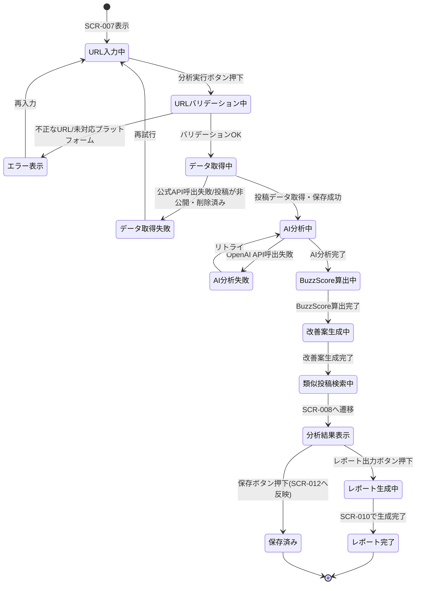
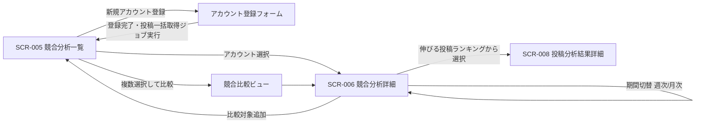

# 04. 画面遷移図

画面IDは `03_screens.md` に準拠します。

## 1. 全体画面遷移（ログイン〜ダッシュボード主要導線）

```mermaid
flowchart TD
    Start([アクセス]) --> Auth{ログイン済み?}
    Auth -- No --> SCR001[SCR-001 ログイン画面]
    Auth -- Yes --> SCR003[SCR-003 ホーム画面]

    SCR001 -- 新規登録リンク --> SCR002[SCR-002 新規登録画面]
    SCR002 -- 登録完了 --> SCR001
    SCR001 -- ログイン成功 --> SCR003

    SCR003 -- サイドナビ: トレンド --> SCR004[SCR-004 トレンド画面]
    SCR003 -- サイドナビ: 競合分析 --> SCR005[SCR-005 競合分析一覧]
    SCR003 -- サイドナビ: 投稿分析 --> SCR007[SCR-007 投稿分析(検索/URL入力)]
    SCR003 -- サイドナビ: AIレポート --> SCR009[SCR-009 AIレポート一覧]
    SCR003 -- サイドナビ: ランキング --> SCR011[SCR-011 ランキング画面]
    SCR003 -- サイドナビ: 保存済み分析 --> SCR012[SCR-012 保存済み分析画面]
    SCR003 -- サイドナビ: 設定 --> SCR013[SCR-013 設定画面]
    SCR003 -- グローバル検索 --> SCR014[SCR-014 検索結果画面]

    SCR004 -- 投稿カードクリック --> SCR008[SCR-008 投稿分析結果詳細]
    SCR004 -- ランキングリンク --> SCR011

    SCR005 -- 競合アカウント選択 --> SCR006[SCR-006 競合分析詳細]
    SCR006 -- 投稿クリック --> SCR008

    SCR007 -- URL入力→分析実行 --> SCR008
    SCR007 -- 検索結果から選択 --> SCR014
    SCR014 -- 投稿選択 --> SCR008
    SCR014 -- アカウント選択 --> SCR006

    SCR008 -- レポート出力ボタン --> SCR010[SCR-010 AIレポート生成/詳細]
    SCR008 -- 保存ボタン --> SCR012
    SCR008 -- 類似投稿クリック --> SCR008

    SCR009 -- レポート選択 --> SCR010
    SCR009 -- 新規生成 --> SCR010

    SCR011 -- 投稿クリック --> SCR008

    SCR012 -- 保存済み分析クリック --> SCR008

    SCR003 -- ログアウト --> SCR001

    classDef auth fill:#fdd,stroke:#933
    classDef main fill:#ddf,stroke:#339
    class SCR001,SCR002 auth
    class SCR003,SCR004,SCR005,SCR006,SCR007,SCR008,SCR009,SCR010,SCR011,SCR012,SCR013,SCR014 main
```

## 2. 投稿URL分析フローの詳細遷移（状態遷移）

投稿URL分析はジョブが非同期で進行するため、状態遷移図で表現します。



## 3. 競合分析フローの画面遷移


