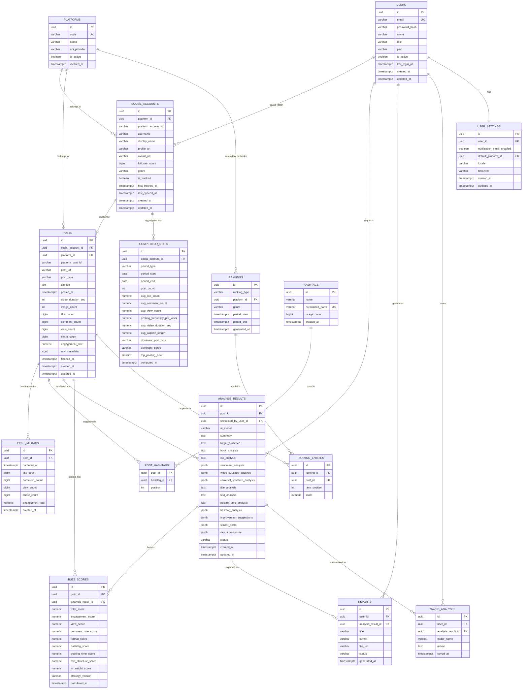

# 05. ER図

本ドキュメントは本システムのデータモデルをER図（Mermaid `erDiagram`）として表現したものです。詳細なカラム定義・型・制約・インデックスは `09_db_design.md` を参照してください。テーブル名・カラム名は全ドキュメントで統一しています。

## 全体ER図

## モデリング上のポイント

- **`platforms` による将来拡張**：SNS種別はコード（enum的な文字列）ではなくマスタテーブル `platforms` として管理することで、YouTube / Pinterest / Threads 追加時にアプリケーションコードの変更を最小限（`SocialPlatform` 実装クラスの追加とマスタレコード追加のみ）にできます。
- **`social_accounts` の汎用化**：自社アカウント・競合アカウントを区別せず同一テーブルで扱い、`is_tracked` フラグで管理対象かどうかを判定します。将来的にアカウント種別（自社/競合/ウォッチリスト）を増やす場合も列挙値の追加のみで対応できます。
- **`posts` と `post_metrics` の分離**：`posts` には最新値（いいね数等）をキャッシュとして保持しつつ、`post_metrics` に取得時点ごとのスナップショットを時系列で保存します。これにより「伸び方（急上昇度合い）」の算出や再取得のたびの履歴管理が可能になります。非公開データ（インプレッション等）はどちらのテーブルにも列を持たせません。
- **`hashtags` / `post_hashtags` の多対多**：1つのハッシュタグが複数投稿で使われ、1つの投稿が複数ハッシュタグを持つ多対多関係を正規化して表現します。
- **`analysis_results` の柔軟なスキーマ**：構成分析・感情分析・改善提案などは投稿種別によって内容の形が変わるため `jsonb` 型で保持し、将来分析項目が増えてもマイグレーションを最小化できます。
- **`buzz_scores` のバージョニング**：`strategy_version` を持たせることで、採点基準（Strategy群の重み付けロジック）を改訂した際に旧スコアとの比較・再計算が可能です。
- **`rankings` / `ranking_entries` の分離**：ランキングという「実行結果のスナップショット」と、その中身である「順位付けされた投稿」を分けることで、急上昇/週間/月間/ジャンル別/SNS別のあらゆる軸のランキングを同一スキーマで表現できます。
- **`reports` と `analysis_results` の関連**：レポートは必ず1つの分析結果に紐づき、PDF/Markdown/HTMLの出力形式ごとに別レコードとして保存します（同じ分析結果から複数形式を出力可能）。
