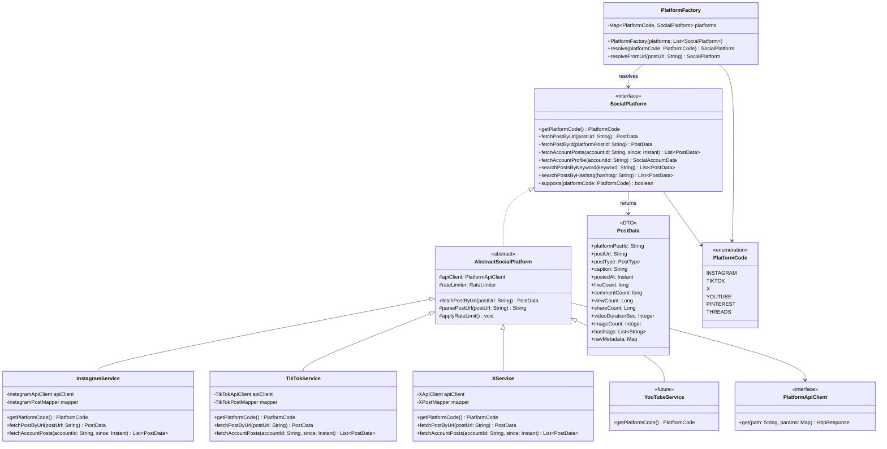
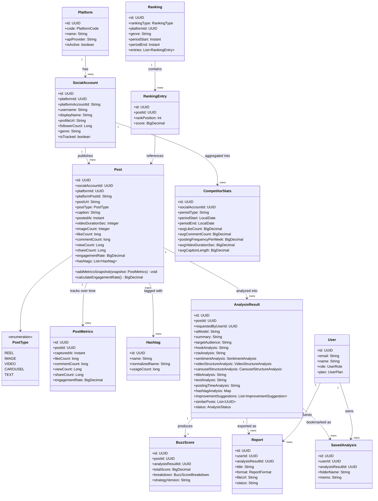
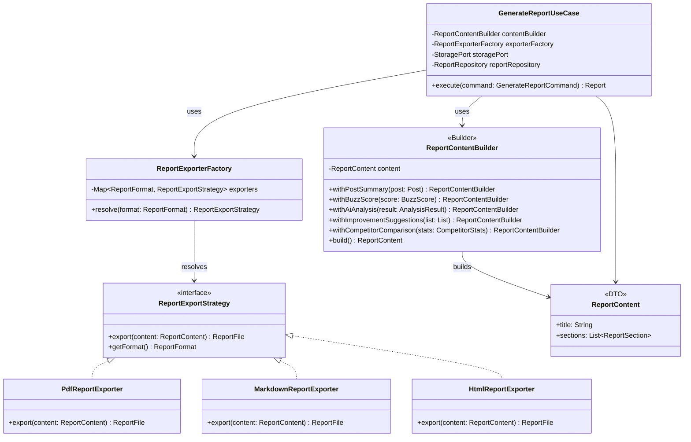

# 07. クラス図

本ドキュメントは主要なドメインモデルおよび、SNS抽象化（Strategy/Factory）・BuzzScore算出（Strategy）・レポート出力（Strategy/Builder）まわりの設計をクラス図として示します。パッケージ構成は `06_directory_structure.md` に対応します。

## 1. SocialPlatform 抽象化とプラットフォーム実装（Strategy + Factory パターン）

新規SNS追加時は `SocialPlatform` を実装するクラスを1つ追加し、`PlatformFactory` に登録するだけで、検索・投稿分析・競合分析などの既存ユースケースにそのまま組み込める設計です。

## 2. BuzzScore 算出（Strategy パターン）

```mermaid
classDiagram
    class BuzzScoreStrategy {
        <<interface>>
        +calculate(context: BuzzScoreContext) StrategyScore
        +getWeight() double
        +getName() String
    }

    class EngagementRateStrategy {
        +calculate(context: BuzzScoreContext) StrategyScore
    }
    class ViewCountStrategy {
        +calculate(context: BuzzScoreContext) StrategyScore
    }
    class CommentRateStrategy {
        +calculate(context: BuzzScoreContext) StrategyScore
    }
    class FormatStrategy {
        +calculate(context: BuzzScoreContext) StrategyScore
    }
    class HashtagStrategy {
        +calculate(context: BuzzScoreContext) StrategyScore
    }
    class PostingTimeStrategy {
        +calculate(context: BuzzScoreContext) StrategyScore
    }
    class TextStructureStrategy {
        +calculate(context: BuzzScoreContext) StrategyScore
    }
    class AiInsightStrategy {
        +calculate(context: BuzzScoreContext) StrategyScore
    }

    class BuzzScoreContext {
        <<DTO>>
        +post: Post
        +postMetrics: PostMetrics
        +analysisResult: AnalysisResult
        +accountBaseline: CompetitorStats
    }

    class StrategyScore {
        <<DTO>>
        +strategyName: String
        +rawScore: double
        +weight: double
    }

    class BuzzScoreCalculator {
        -List~BuzzScoreStrategy~ strategies
        +BuzzScoreCalculator(strategies: List~BuzzScoreStrategy~)
        +calculate(context: BuzzScoreContext) BuzzScore
        -aggregate(scores: List~StrategyScore~) double
    }

    BuzzScoreStrategy <|.. EngagementRateStrategy
    BuzzScoreStrategy <|.. ViewCountStrategy
    BuzzScoreStrategy <|.. CommentRateStrategy
    BuzzScoreStrategy <|.. FormatStrategy
    BuzzScoreStrategy <|.. HashtagStrategy
    BuzzScoreStrategy <|.. PostingTimeStrategy
    BuzzScoreStrategy <|.. TextStructureStrategy
    BuzzScoreStrategy <|.. AiInsightStrategy
    BuzzScoreCalculator o-- "8" BuzzScoreStrategy : composes
    BuzzScoreCalculator --> BuzzScoreContext : uses
    BuzzScoreStrategy --> StrategyScore : returns
    BuzzScoreCalculator --> BuzzScore : produces
```

## 3. ドメインエンティティ関連（集約ルートと関連エンティティ）

## 4. アプリケーション層：ユースケース・Command・Repository・DI の関係

Repository（インターフェースはdomain層、実装はinfrastructure層）、Command（ユースケース入力のカプセル化）、Observer（ドメインイベント発行・購読）、DIによる疎結合を示します。

```mermaid
classDiagram
    class AnalyzePostUrlCommand {
        <<Command>>
        +postUrl: String
        +requestedByUserId: UUID
    }

    class AnalyzePostUrlUseCase {
        -SocialPlatformPort socialPlatformPort
        -PostRepository postRepository
        -AiAnalysisPort aiAnalysisPort
        -BuzzScoreCalculator buzzScoreCalculator
        -AnalysisResultRepository analysisResultRepository
        -ApplicationEventPublisher eventPublisher
        +execute(command: AnalyzePostUrlCommand) AnalysisResult
    }

    class SocialPlatformPort {
        <<interface>>
        +resolveAndFetch(postUrl: String) PostData
    }

    class AiAnalysisPort {
        <<interface>>
        +analyze(post: Post, promptContext: Map) AnalysisResult
    }

    class PostRepository {
        <<interface>>
        +save(post: Post) Post
        +findByPlatformPostId(platformId: UUID, platformPostId: String) Optional~Post~
        +search(criteria: PostSearchCriteria) Page~Post~
    }

    class AnalysisResultRepository {
        <<interface>>
        +save(result: AnalysisResult) AnalysisResult
        +findByPostId(postId: UUID) Optional~AnalysisResult~
    }

    class PostAnalyzedEvent {
        <<DomainEvent>>
        +postId: UUID
        +analysisResultId: UUID
    }

    class ReportAutoGenerationListener {
        <<Observer>>
        +onPostAnalyzed(event: PostAnalyzedEvent) void
    }

    class RankingUpdateListener {
        <<Observer>>
        +onPostAnalyzed(event: PostAnalyzedEvent) void
    }

    class CacheInvalidationListener {
        <<Observer>>
        +onPostAnalyzed(event: PostAnalyzedEvent) void
    }

    class PostRepositoryJpaAdapter {
        <<infrastructure>>
        -PostJpaRepository jpaRepository
        -PostMapper mapper
        +save(post: Post) Post
        +findByPlatformPostId(platformId: UUID, platformPostId: String) Optional~Post~
        +search(criteria: PostSearchCriteria) Page~Post~
    }

    AnalyzePostUrlUseCase --> AnalyzePostUrlCommand : handles
    AnalyzePostUrlUseCase --> SocialPlatformPort : uses (DI)
    AnalyzePostUrlUseCase --> AiAnalysisPort : uses (DI)
    AnalyzePostUrlUseCase --> PostRepository : uses (DI)
    AnalyzePostUrlUseCase --> AnalysisResultRepository : uses (DI)
    AnalyzePostUrlUseCase --> BuzzScoreCalculator : uses (DI)
    AnalyzePostUrlUseCase ..> PostAnalyzedEvent : publishes
    PostRepository <|.. PostRepositoryJpaAdapter : implements
    PostAnalyzedEvent <.. ReportAutoGenerationListener : subscribes
    PostAnalyzedEvent <.. RankingUpdateListener : subscribes
    PostAnalyzedEvent <.. CacheInvalidationListener : subscribes
```

## 5. レポート出力（Strategy + Builder パターン）

## 6. 適用パターンまとめ

| パターン | 適用箇所 | 目的 |
|----------|----------|------|
| Repository | `domain.repository.*`（インターフェース） / `infrastructure.persistence.repository.*`（JPA実装） | ドメイン層をDB技術詳細から分離する |
| Factory | `PlatformFactory`、`ReportExporterFactory` | プラットフォームコードや出力形式に応じた実装解決をカプセル化する |
| Strategy | `SocialPlatform` 実装群、`BuzzScoreStrategy` 実装群、`ReportExportStrategy` 実装群 | アルゴリズム・振る舞いの切り替えを容易にし、拡張時の既存コード改修を防ぐ（開放閉鎖の原則） |
| Builder | `AnalysisPromptBuilder`（AIプロンプト構築）、`ReportContentBuilder`（レポート内容構築） | 複数のオプション項目からなる複雑なオブジェクトを段階的に構築する |
| Observer | `PostAnalyzedEvent` とそのリスナー群 | 投稿分析完了後の副作用（レポート自動生成、ランキング更新、キャッシュ無効化）を疎結合に実行する |
| Command | `AnalyzePostUrlCommand`、`GenerateReportCommand` 等 | ユースケースの入力をオブジェクト化し、Undo/監査ログ/非同期キュー投入を容易にする |
| DI（依存性注入） | Spring のコンストラクタインジェクション全般 | インターフェースを介した疎結合を実現し、テスト時にモック差し替えを容易にする |
