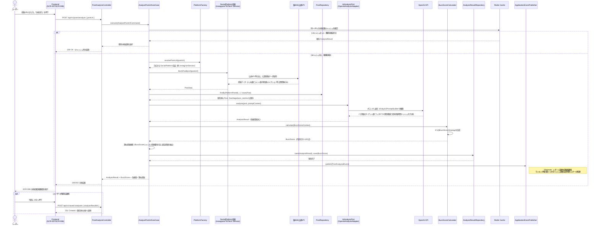
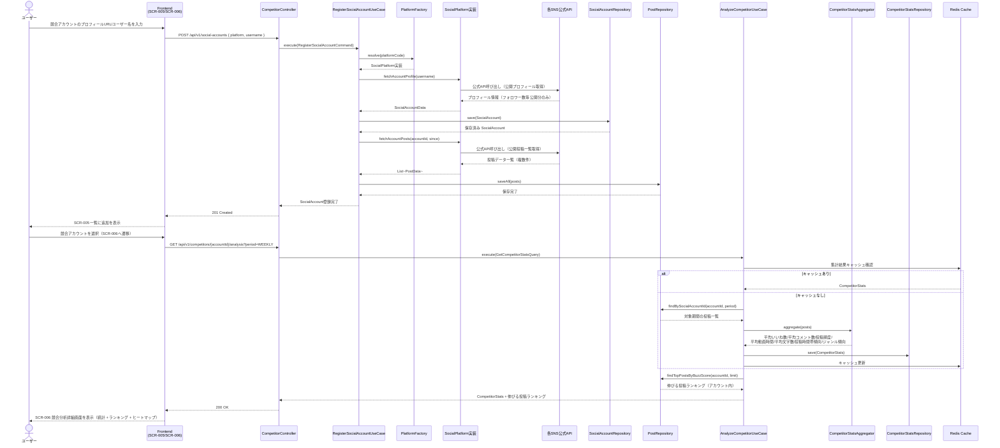
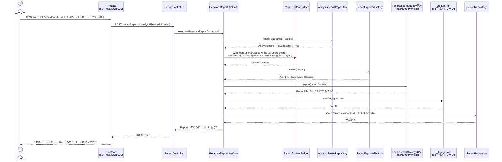

# 08. シーケンス図

本ドキュメントは代表的な2つの主要フロー（投稿URL分析、競合分析）に加え、関連する補助フロー（AIレポート生成）をMermaidシーケンス図で示します。登場するクラス名は `07_class_diagram.md` に対応します。

## 1. 投稿URL分析フロー

「URL入力 → データ取得 → AI分析 → BuzzScore算出 → 改善案生成 → 類似投稿提案 → 保存」までの一連の流れです。

## 2. 競合分析フロー

「競合アカウント登録 → 投稿一括取得 → 統計集計 → ランキング表示」の流れです。

## 3. AIレポート生成・出力フロー（補助フロー）

投稿分析結果画面から「レポート出力」を押した際のワンクリック出力の流れです。

