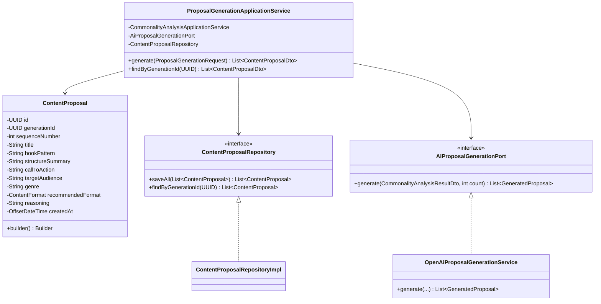
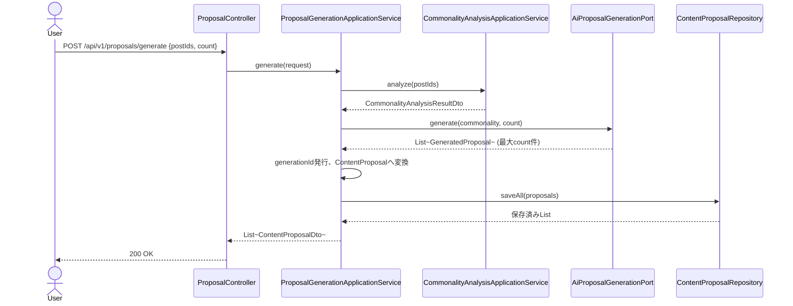

# Phase10: 企画生成AI

## 1. 目的

Phase8（共通点分析）の結果を元に、AIが20件の投稿企画（タイトル案・フック・構成・CTA・ターゲット・ジャンル・推奨フォーマット）を生成する。生成結果はユーザーが後から参照できるよう永続化する（Phase17ダッシュボードの「AI企画」画面での一覧表示を見込む）。

## 2. セルフレビュー（実現可能性・設計論点）

### 2.1 データ取得の実現可能性

新たな外部SNSデータ取得は発生しない。入力はPhase8で既に取得済みの投稿の共通パターン（`CommonalityAnalysisResultDto`）とOpenAI Chat Completions APIのみであり、ToS・API制約上の新規リスクはない。

### 2.2 20件を一度のプロンプトで生成する場合のJSON構造化の信頼性

`OpenAiClient.chatComplete()`は`response_format: json_object`を強制するが、これは**トップレベルがJSONオブジェクトであること**のみを保証し、配列そのものを直接返すことはできない（OpenAI仕様）。またモデルが厳密に20件ちょうど返す保証もない。

対応方針:
- レスポンスは`{"proposals": [ {...}, ... ]}`という**ラッパーオブジェクト**形式で受け取る（Phase8までと同じ`chatComplete`の使い方を踏襲しつつ、配列部分だけラップする）。
- プロンプトで「必ず20件」「各企画は独立したJSONオブジェクト」と明示するが、コード側では**件数を信頼せず**、返ってきた配列を`min(取得件数, 要求件数)`で切り詰める。不足時はそのまま件数分のみ返す（不足を埋めるための水増し生成は行わない＝Phase1以来の「未計測と推測値を混同しない」原則と同じく、AIが生成しなかったものを無理に埋めない）。
- 個々のproposalオブジェクトの必須キーが欠けている場合はそのproposalをスキップする（部分的なJSON破損で全体を失敗させない）。
- APIキー未設定・呼び出し失敗時は、Phase8/9と同様にルールベースのフォールバック（共通パターンの文言をそのまま使った定型企画を`count`件、通し番号付きで生成）を返す。

### 2.3 企画の永続化要否

Phase17のダッシュボード構成に「AI企画」画面が含まれる（ユーザーが過去に生成した企画を見返す用途）ため、**永続化する**。1回の生成（20件）を`generationId`でグルーピングする新規集約`ContentProposal`を導入する。既存の`SavedAnalysis`（投稿のブックマーク）とはドメインが異なるため流用せず、新規テーブル`content_proposals`を新設する（既存拡張ではなく新規、という判断はPhase1-9の「既存流用優先」方針からの意図的な逸脈であり、理由は対象エンティティ自体が新規であるため）。

### 2.4 依拠する統計・パターンの由来を保持する

生成された企画がどの共通点分析結果を元にしたか追跡できるよう、`sourceTitlePattern`等は保持せず、代わりに生成リクエストの投稿IDリストのハッシュ的な追跡は行わない（過剰設計を避ける）。その代わり`generationId`単位でまとめて取得できれば十分と判断した。

## 3. 設計

### 3.1 クラス図

### 3.2 シーケンス図

### 3.3 データ設計

`content_proposals`テーブル新設（V8マイグレーション）: `id, generation_id, sequence_number, title, hook_pattern, structure_summary, call_to_action, target_audience, genre, recommended_format, reasoning, created_at`。`generation_id`にインデックスを張り一括取得を高速化する。

## 4. 実装結果

- `domain/proposal/ContentProposal.java`（Builder）, `ContentProposalRepository.java`
- `application/proposal/AiProposalGenerationPort.java`（`GeneratedProposal` record）
- `application/proposal/ProposalGenerationApplicationService.java`: Phase8の`CommonalityAnalysisApplicationService`を再利用し、AI生成→`generationId`採番→永続化
- `application/proposal/dto/ProposalGenerationRequest.java`, `ContentProposalDto.java`
- `infrastructure/external/openai/OpenAiProposalGenerationService.java`: `{"proposals":[...]}`形式でパース、件数超過は切り詰め、必須キー欠落分はスキップ、フォールバックは共通パターン文言を使った定型企画
- `infrastructure/persistence/entity/ContentProposalEntity.java` / `mapper` / `adapter` / `repository`（JPA, Repositoryパターン）
- `db/migration/V8__content_proposals.sql`
- `presentation/controller/ProposalController.java`: `POST /api/v1/proposals/generate`, `GET /api/v1/proposals/{generationId}`
- テスト: `ProposalGenerationApplicationServiceTest`, `OpenAiProposalGenerationServiceTest`（Phase5-9同様、新規JPA実装自体へのTestcontainers ITは追加せず、既存の`PostRepositoryImplIT`/`EmbeddingRepositoryImplIT`のみとする方針を踏襲）

## 5. レビュー

### 5.1 懸念点

- AIが返す`proposals`配列の件数・品質はプロンプト任せの部分が残る。将来的には生成後にPhase14（投稿評価AI）で自己採点させ、閾値未満は再生成する仕組みも検討可能（今回はスコープ外）。
- `recommendedFormat`はAIの自由記述をenumにマッピングする必要があり、想定外の文字列が返る可能性がある → 未知の値は`null`として扱いフォールバックしない設計とした（実装で確認）。

### 5.2 改善案

- 生成企画をPhase11（台本生成AI）・Phase12（カルーセル生成AI）の入力として直接連携できるよう、`ContentProposal.id`を後続フェーズが参照する設計にする。

## 6. 次フェーズプレビュー

Phase11（台本生成AI）では、Phase10で生成された企画（`ContentProposal`）を入力に、30/60/90秒動画のナレーション・テロップ・BGMイメージ・CTA・カット構成を生成する。セルフレビューでは「尺（秒数）に応じたカット割りの妥当性をAIにどう担保させるか」「台本の永続化と企画への紐付け方」を中心に整理する。
