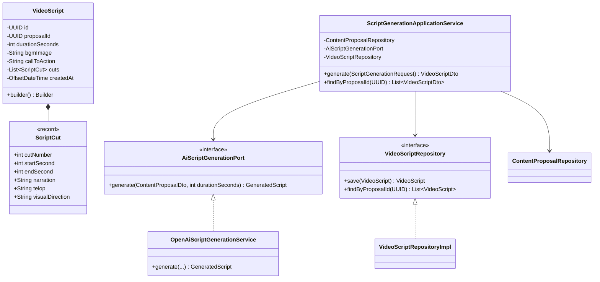
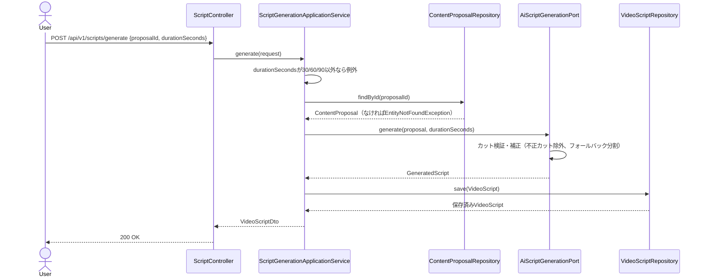

# Phase11: 台本生成AI

## 1. 目的

Phase10で生成された投稿企画（`ContentProposal`）を入力に、30/60/90秒動画のナレーション・テロップ（キャプション）・BGMイメージ・CTA・カット構成をAIが生成する。

## 2. セルフレビュー（実現可能性・設計論点）

### 2.1 データ取得の実現可能性

新規の外部SNSデータ取得は発生しない。入力はPhase10で永続化済みの`ContentProposal`とOpenAI Chat Completions APIのみであり、ToS・API制約上の新規リスクはない。

### 2.2 尺（秒数）に応じたカット割りの妥当性をAIにどう担保させるか

AIの応答するカット構成（`cuts`配列の各カットの開始/終了秒）は、以下の理由で**信頼せず必ずコード側で検証・補正**する:

- 尺は30/60/90秒の3値のみ許可（`BusinessRuleViolationException`で拒否）。
- 各カットは`startSecond < endSecond`かつ`0 <= startSecond`かつ`endSecond <= durationSeconds`を満たさない場合は**そのカットを除外**する（Phase10の「必須項目欠落はスキップ」と同じ考え方）。
- カットは`cutNumber`昇順に並び替える。
- 検証後にカットが1件も残らない場合（AI応答が壊れている等）は、**フォールバック**として尺を「フック(最初20%)・本編(60%)・CTA(最後20%)」の3カット構成に機械的に分割する（OpenAI未接続時の既定フォールバックとしても同じロジックを使う）。
- カット間の重複・隙間（例: 0-10秒の次が15-20秒）は許容する（AIの自然な間の取り方を尊重し、過剰な自動補正はしない）。厳密な連続性はUI側での確認に委ねる。

### 2.3 台本の永続化と企画への紐付け方

Phase10と同じ判断基準（Phase17ダッシュボードでの参照用途）で永続化する。`VideoScript`集約を新設し、`proposalId`で`ContentProposal`と1対多（同じ企画から異なる尺の台本を複数生成可能）に紐付ける。カット構成は可変長のため、既存の`StringDoubleMapJsonConverter`と同じ方針（JPA `AttributeConverter`でJSON文字列列に格納）で`List<ScriptCut>`用の新規コンバータを追加する（新規に子テーブルを設けるほどの複雑さはないため、Phase9の分布Map格納と同様にJSON列で十分と判断）。

### 2.4 企画IDの存在検証

`proposalId`は`ContentProposalRepository`に`findById`を追加して検証する（Phase10時点では`saveAll`/`findByGenerationId`のみだったため今回追加）。存在しない場合は`EntityNotFoundException`。

## 3. 設計

### 3.1 クラス図

### 3.2 シーケンス図

### 3.3 データ設計

`video_scripts`テーブル新設（V9マイグレーション）: `id, proposal_id, duration_seconds, bgm_image, call_to_action, cuts(TEXT/JSON), created_at`。`proposal_id`にインデックス。FKは`content_proposals(id)`へON DELETE CASCADE。

## 4. 実装結果

- `domain/script/ScriptCut.java`（record）, `VideoScript.java`（Builder）, `VideoScriptRepository.java`
- `domain/proposal/ContentProposalRepository.java`: `findById(UUID)`を追加
- `application/script/AiScriptGenerationPort.java`（`GeneratedScript`/`GeneratedCut` record）
- `application/script/ScriptGenerationApplicationService.java`: 尺バリデーション、企画存在確認、AI生成、永続化
- `application/script/dto/ScriptGenerationRequest.java`, `VideoScriptDto.java`
- `infrastructure/external/openai/OpenAiScriptGenerationService.java`: カット検証・補正ロジック、フォールバック（3分割）
- `infrastructure/persistence/converter/ScriptCutListJsonConverter.java`（新規）
- `infrastructure/persistence/entity/VideoScriptEntity.java` / `mapper` / `adapter` / `repository`
- `db/migration/V9__video_scripts.sql`
- `presentation/controller/ScriptController.java`: `POST /api/v1/scripts/generate`, `GET /api/v1/scripts/proposal/{proposalId}`
- テスト: `ScriptGenerationApplicationServiceTest`, `OpenAiScriptGenerationServiceTest`（カット検証・フォールバック分割の単体テスト中心）

## 5. レビュー

### 5.1 懸念点

- カットの「フック20%/本編60%/CTA20%」というフォールバック比率は暫定値であり、実データでの検証（A/Bテスト等）は将来のスコープ。
- テロップの文字数上限などSNS側の表示制約（例: TikTokキャプション文字数）は今回のプロンプトには含めていない。プラットフォーム横断の台本としているため、投稿時にプラットフォーム別の調整が必要になる可能性がある。

### 5.2 改善案

- Phase14（投稿評価AI）で生成済み台本を自己評価し、フィードバックループを作る。

## 6. 次フェーズプレビュー

Phase12（カルーセル生成AI）では、Phase10の企画を入力に、Instagramカルーセル形式（1ページ目フック・2-8ページ目説明・最終ページCTA）を生成する。セルフレビューでは「ページ数の可変長設計（最小2〜最大8ページ）をAIにどう守らせるか」「Phase11の台本生成と共通化できる基盤（企画ID紐付け、フォールバック設計）の再利用範囲」を中心に整理する。
