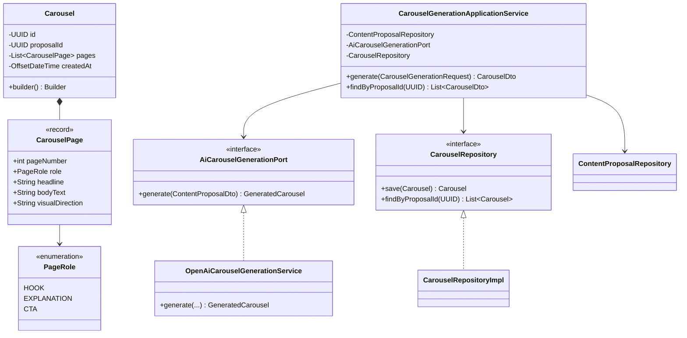
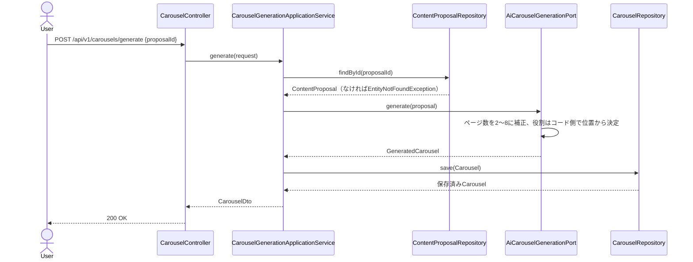

# Phase12: カルーセル生成AI

## 1. 目的

Phase10で生成された投稿企画（`ContentProposal`）を入力に、Instagramカルーセル形式（1ページ目フック・2〜7ページ目説明・最終ページCTA、合計2〜8ページ）をAIが生成する。

## 2. セルフレビュー（実現可能性・設計論点）

### 2.1 データ取得の実現可能性

新規の外部SNSデータ取得は発生しない。入力はPhase10で永続化済みの`ContentProposal`とOpenAI Chat Completions APIのみであり、ToS・API制約上の新規リスクはない。

### 2.2 ページ数の可変長設計（最小2〜最大8ページ）をAIにどう守らせるか

Phase11（台本生成AI）でのカット秒数と同様、AIの応答をそのまま信頼しない方針を踏襲する。加えて今回は**「各ページの役割（フック/説明/CTA）をAIに判定させない」**という、Phase11よりも踏み込んだ設計判断を行う:

- AIには「headline・bodyText・visualDirection」のみを配列で生成させ、**役割(role)はコード側で配列内の位置から機械的に決定する**（先頭=HOOK、末尾=CTA、それ以外=EXPLANATION）。これによりAIが役割ラベルを誤ってもロジック上破綻しない。
- 応答のページ数が2〜8の範囲外の場合は、2未満なら（1ページ内容だけでも）失敗として空リストにしてフォールバックへ、8超過なら先頭8件に切り詰める。
- 検証後にページが0件（AI応答が壊れている）の場合は、Phase11同様にフォールバック（企画の`hookPattern`をページ1、`structureSummary`を中間の1ページ、`callToAction`を最終ページとする3ページ構成）を返す。

### 2.3 台本生成(Phase11)との共通化できる基盤の再利用範囲

企画ID紐付け（`proposalId`によるFK）・永続化のJSON列格納方式（`AttributeConverter`）・フォールバック哲学（機械的分割）はPhase11と同一パターンを流用する。ただし集約自体（`VideoScript`と`Carousel`）はドメインが異なるため別集約として新設する（無理な共通の親クラス抽出は行わない。責務が異なるため、パターンの再利用に留め、コードの共有はしない）。

## 3. 設計

### 3.1 クラス図

### 3.2 シーケンス図

### 3.3 データ設計

`carousels`テーブル新設（V10マイグレーション）: `id, proposal_id, pages(TEXT/JSON), created_at`。`proposal_id`にインデックス。FKは`content_proposals(id)`へON DELETE CASCADE（Phase11の`video_scripts`と同方針）。

## 4. 実装結果

- `domain/carousel/PageRole.java`（enum）, `CarouselPage.java`（record）, `Carousel.java`（Builder）, `CarouselRepository.java`
- `application/carousel/AiCarouselGenerationPort.java`（`GeneratedCarousel`/`GeneratedPage` record。`GeneratedPage`はrole非保持、位置から決定）
- `application/carousel/CarouselGenerationApplicationService.java`: 企画存在確認、AI生成、永続化
- `application/carousel/dto/CarouselGenerationRequest.java`, `CarouselDto.java`, `CarouselPageDto.java`
- `infrastructure/external/openai/OpenAiCarouselGenerationService.java`: ページ数補正（2〜8）、役割の位置決定、フォールバック（3ページ構成）
- `infrastructure/persistence/converter/CarouselPageListJsonConverter.java`（新規）
- `infrastructure/persistence/entity/CarouselEntity.java` / `mapper` / `adapter` / `repository`
- `db/migration/V10__carousels.sql`
- `presentation/controller/CarouselController.java`: `POST /api/v1/carousels/generate`, `GET /api/v1/carousels/proposal/{proposalId}`
- テスト: `CarouselGenerationApplicationServiceTest`, `OpenAiCarouselGenerationServiceTest`（ページ数補正・役割決定・フォールバックの単体テスト中心）

## 5. レビュー

### 5.1 懸念点

- 「役割をAIに判定させずコード側で位置から決定する」設計は堅牢だが、AIが例えば7ページ構成で2ページ目にCTA的な内容を書いてしまっても、コードは2ページ目をEXPLANATIONとして扱う。プロンプト指示で「中間ページに完結したCTAを書かない」よう伝えることで緩和する。

### 5.2 改善案

- Phase13（画像生成プロンプト）で、各ページの`visualDirection`を入力にChatGPT Image/DALL·E向けプロンプトを生成する連携を行う。

## 6. 次フェーズプレビュー

Phase13（画像生成プロンプト）では、Phase11の`visualDirection`・Phase12の各ページ`visualDirection`を入力に、画像生成AI（ChatGPT Image/DALL·E）向けの具体的な生成プロンプト文字列を作成する。セルフレビューでは「画像生成そのものは実行するか、プロンプト文字列の生成に留めるか（コスト・著作権上の判断）」を中心に整理する。
