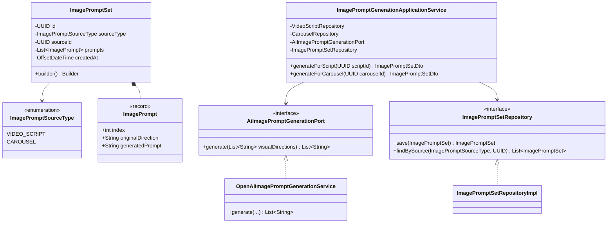
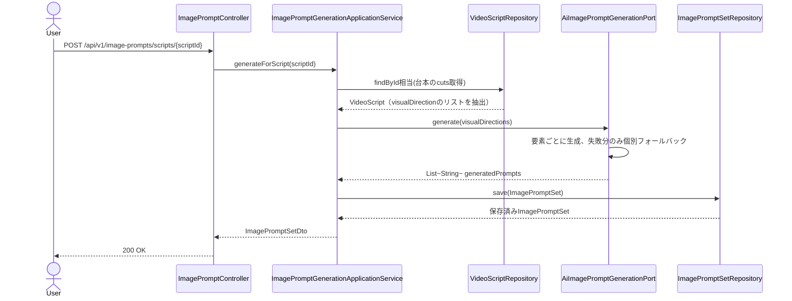

# Phase13: 画像生成プロンプト

## 1. 目的

Phase11（台本生成AI）の各カット`visualDirection`、Phase12（カルーセル生成AI）の各ページ`visualDirection`を入力に、画像生成AI（ChatGPT Image/DALL·E等）向けの具体的な生成プロンプト文字列を作成する。

## 2. セルフレビュー（実現可能性・設計論点）

### 2.1 画像生成そのものは実行するか、プロンプト文字列の生成に留めるか（コスト・著作権上の判断）

**プロンプト文字列の生成に留め、画像生成API（DALL·E/gpt-image等）の呼び出しは行わない**。理由:

- コスト: 画像生成は1件あたりのAPIコストがテキスト生成より高く、企画1件につき最大8件（カルーセル最大ページ数）×複数生成物が発生しうるため、無制限に自動生成するとコストが急増する。
- 著作権・コンテンツポリシー: 自動生成された画像を人間のレビューなしにそのまま投稿素材として確定させるのはリスクがある（意図しない著作権侵害的な生成、SNS側のコンテンツポリシー違反等）。プロンプトを人間が確認し、必要に応じて画像生成ツール側で個別に生成・選定する運用の方が安全。
- 本プラットフォームの位置づけは「マーケティングOS」（企画・台本・構成の支援）であり、画像アセットの自動確定までは要求仕様のスコープ外と判断する。

→ 本フェーズの成果物は**プロンプト文字列（テキスト）のみ**。実際の画像生成はユーザーが外部ツールに貼り付けて行う想定。

### 2.2 台本生成(Phase11)・カルーセル生成(Phase12)との入力形式の違いをどう吸収するか

`VideoScript`の`cuts[].visualDirection`と`Carousel`の`pages[].visualDirection`は、どちらも「短い映像/画像の方向性の一文」という共通のデータ形状を持つ。両者を無理に共通の親集約に統合せず、**入力を「visualDirectionの文字列リスト」に正規化してAIポートに渡す**ことで、Phase11/12のドメインモデルには手を加えずに済ませる（Anti-Corruption Layer的な考え方をPhase1の`NormalizedPost`と同様に踏襲）。

### 2.3 永続化要否・部分的なAI失敗への対処

Phase17ダッシュボードでの参照用途を想定し永続化する。ただし、Phase10-12と異なり「まとまりとしての妥当性検証」（尺・ページ数のような制約）は不要で、各`visualDirection`は独立している。そのため**要素ごとに独立してAI生成し、失敗した要素だけルールベースのフォールバック（元のvisualDirectionにスタイル指定を機械的に付加）に切り替える**（Phase10/11/12の「全滅時のみ一括フォールバック」より粒度を細かくした設計）。

## 3. 設計

### 3.1 クラス図

### 3.2 シーケンス図

### 3.3 データ設計

`image_prompt_sets`テーブル新設（V11マイグレーション）: `id, source_type, source_id, prompts(TEXT/JSON), created_at`。`(source_type, source_id)`にインデックス。`source_id`は`video_scripts`/`carousels`いずれかを指すポリモーフィックな参照のためDB外部キー制約は付けない（アプリ層で整合性を保証）。

## 4. 実装結果

- `domain/imageprompt/ImagePromptSourceType.java`（enum）, `ImagePrompt.java`（record）, `ImagePromptSet.java`（Builder）, `ImagePromptSetRepository.java`
- `application/imageprompt/AiImagePromptGenerationPort.java`
- `application/imageprompt/ImagePromptGenerationApplicationService.java`: `generateForScript(UUID)`/`generateForCarousel(UUID)`。Phase11/12のリポジトリから`visualDirection`リストを抽出し正規化
- `application/imageprompt/dto/ImagePromptSetDto.java`, `ImagePromptDto.java`
- `infrastructure/external/openai/OpenAiImagePromptGenerationService.java`: 要素ごとの生成・個別フォールバック（スタイル指定の機械的付加）
- `infrastructure/persistence/converter/ImagePromptListJsonConverter.java`（新規）
- `infrastructure/persistence/entity/ImagePromptSetEntity.java` / `mapper` / `adapter` / `repository`
- `db/migration/V11__image_prompt_sets.sql`
- `presentation/controller/ImagePromptController.java`: `POST /api/v1/image-prompts/scripts/{scriptId}`, `POST /api/v1/image-prompts/carousels/{carouselId}`
- テスト: `ImagePromptGenerationApplicationServiceTest`, `OpenAiImagePromptGenerationServiceTest`（要素ごとの部分失敗フォールバックを中心に検証）

## 5. レビュー

### 5.1 懸念点

- プロンプト文字列の品質（画像生成AIでの再現性）はモデル任せの部分が残る。将来的にはブランドカラー・トンマナ等のアカウント単位設定をプロンプトに反映する拡張が考えられる（現状はスコープ外）。
- ポリモーフィックな`source_id`参照はDB外部キー制約による整合性保証がない。運用上は台本/カルーセル削除時に孤立レコードが残りうるが、参照専用の生成物であり実害は小さいと判断した。

### 5.2 改善案

- Phase14（投稿評価AI）の対象範囲を検討する際、画像プロンプトの評価は行わず、台本・カルーセルのテキスト構造評価に絞ることを次フェーズのセルフレビューで確認する。

## 6. 次フェーズプレビュー

Phase14（投稿評価AI）では、ユーザーが作成した（またはAIが生成した）台本・カルーセル構成を入力に、企画との一致率・想定ターゲット・改善提案・CTA/フック改善案・予測投稿スコアをAIが評価する。セルフレビューでは「評価対象をPhase10-12の生成物に限定するか、ユーザーの自由入力（未保存のテキスト）も受け付けるか」「予測投稿スコアの算出根拠（Phase7のランキングスコアとの関係）」を中心に整理する。
