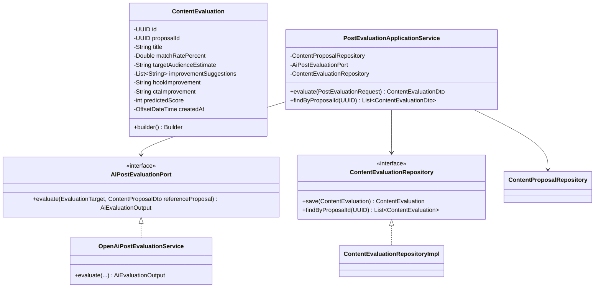
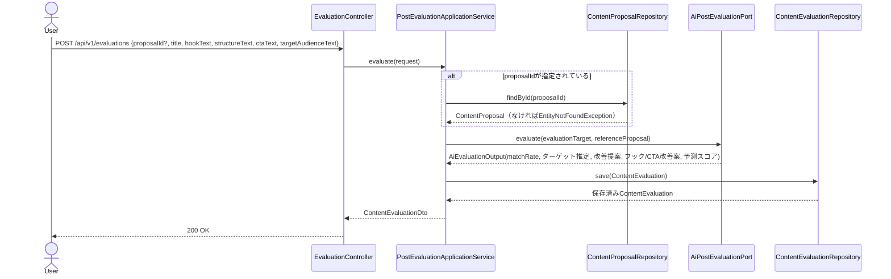

# Phase14: 投稿評価AI

## 1. 目的

ユーザーが作成した（またはAIが生成した）台本・カルーセル構成等の投稿内容を入力に、企画との一致率・想定ターゲット・改善提案・CTA/フック改善案・予測投稿スコアをAIが評価する。

## 2. セルフレビュー（実現可能性・設計論点）

### 2.1 データ取得の実現可能性

新規の外部SNSデータ取得は発生しない。入力は評価対象のテキスト内容とOpenAI Chat Completions APIのみであり、ToS・API制約上の新規リスクはない。

### 2.2 評価対象をPhase10-12の生成物に限定するか、ユーザーの自由入力（未保存のテキスト）も受け付けるか

要求仕様は「ユーザーが作成した台本/構成」の評価であり、必ずしもPhase10-12でAIが生成し永続化したものとは限らない（ユーザーが独自に手直しした内容や、プラットフォーム外で作成した内容も評価対象になりうる）。そのため、**評価APIはPhase10-12の集約IDではなく、フリーテキストの構造化フィールド（タイトル/フック/構成/CTA/ターゲット）を直接受け取る**設計とする。

一方で「企画との一致率」を求めるには比較対象となる元の企画が必要なため、**`proposalId`を任意項目として受け付け、指定があればPhase10の`ContentProposal`を取得してAIへの比較材料として渡す**。`proposalId`未指定の場合は一致率(`matchRatePercent`)を`null`として返す（Phase1以来の「未計測はnull、0と混同しない」原則をここでも踏襲。企画との比較基準がない状態を無理に0%評価にしない）。

これにより、Phase10-12の生成物をそのまま評価する場合（呼び出し側がDTOのフィールドをリクエストに詰め替えて`proposalId`も渡す）と、ユーザーの自由入力を評価する場合（`proposalId`省略）の両方を1つのAPIでカバーできる。

### 2.3 予測投稿スコアの算出根拠（Phase7のランキングスコアとの関係）

Phase7の総合ランキングスコアは、**既に投稿済みで実測値（いいね数・BuzzScore等）が存在する投稿**を対象にした相対順位付けである。一方、本フェーズで評価する内容は**未投稿**であり、実測エンゲージメントが存在しない。したがって:

- 予測投稿スコア(`predictedScore`、0〜100の整数)は、Phase7のランキングスコアとは**算出根拠が異なる独立した指標**とする（実測値ではなく、AIによる定性的な予測評価）。
- Phase7の計算式（重み付き平均）を流用・混同しない。プロンプトでAIに「フック・構成・CTA・ターゲットの明確さ」等の定性的観点から0〜100点で見積もらせる。
- 実際に投稿された後の実測スコアとAI予測スコアを比較検証する仕組み（予測精度の追跡）は本フェーズのスコープ外とする（将来の改善案として記録）。

## 3. 設計

### 3.1 クラス図

### 3.2 シーケンス図

### 3.3 データ設計

`content_evaluations`テーブル新設（V12マイグレーション）: `id, proposal_id(NULL許容), title, match_rate_percent(NULL許容), target_audience_estimate, improvement_suggestions(TEXT/JSON), hook_improvement, cta_improvement, predicted_score, created_at`。`proposal_id`は`content_proposals(id)`へFK、ON DELETE SET NULL（企画が削除されても評価履歴自体は残す）。

## 4. 実装結果

- `domain/evaluation/ContentEvaluation.java`（Builder）, `ContentEvaluationRepository.java`
- `application/evaluation/AiPostEvaluationPort.java`（`EvaluationTarget`/`AiEvaluationOutput` record）
- `application/evaluation/PostEvaluationApplicationService.java`: `proposalId`任意、指定時のみ企画取得・比較材料化
- `application/evaluation/dto/PostEvaluationRequest.java`, `ContentEvaluationDto.java`
- `infrastructure/external/openai/OpenAiPostEvaluationService.java`: `proposalId`有無でプロンプトを出し分け（比較材料の有無）、フォールバックはヒューリスティック（各項目の文字数・キーワード有無等からの簡易スコアリング）
- `infrastructure/persistence/converter/StringListJsonConverter.java`（新規、`improvementSuggestions`用）
- `infrastructure/persistence/entity/ContentEvaluationEntity.java` / `mapper` / `adapter` / `repository`
- `db/migration/V12__content_evaluations.sql`
- `presentation/controller/EvaluationController.java`: `POST /api/v1/evaluations`, `GET /api/v1/evaluations/proposal/{proposalId}`
- テスト: `PostEvaluationApplicationServiceTest`, `OpenAiPostEvaluationServiceTest`（proposalId有無の分岐、フォールバックスコアリングを中心に検証）

## 5. レビュー

### 5.1 懸念点

- `predictedScore`はAIの定性判断に依存し、実測値との相関は未検証（2.3節参照）。
- フォールバック時のヒューリスティックスコアリングは簡易的であり、OpenAI未接続環境では評価の精度が大きく下がる旨をAPIレスポンス・ドキュメントで明示する必要がある（現状は`improvementSuggestions`にフォールバックである旨の注記を含める対応に留める）。

### 5.2 改善案

- 将来的に、投稿後の実測BuzzScore（Phase7）とAI予測スコアの差分を追跡し、プロンプトやフォールバックロジックの精度改善にフィードバックする仕組みを検討する。

## 6. 次フェーズプレビュー

Phase15（トレンド分析）では、日次でのトレンド分析（急上昇キーワード/ジャンル/構成/ハッシュタグ）を行う。セルフレビューでは「トレンド判定の基準（急上昇をどう定義するか。実データの時系列比較に必要な最低限のサンプル数）」「日次バッチとして自動実行する場合の実行基盤（既存の定期データ取得バッチとの関係）」を中心に整理する。
