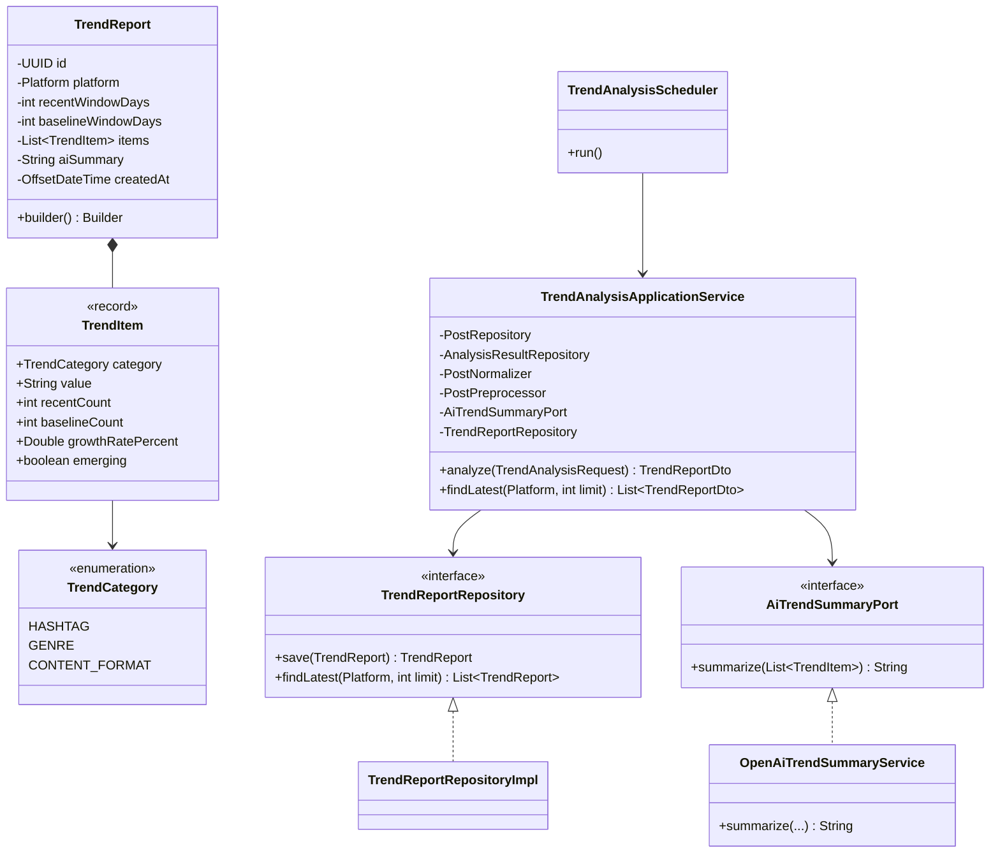
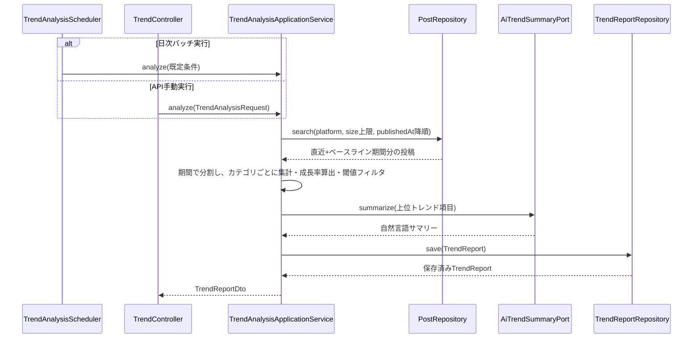

# Phase15: トレンド分析

## 1. 目的

日次で、急上昇しているハッシュタグ・ジャンル・コンテンツ形式を検出し、トレンドとしてレポート化する。

## 2. セルフレビュー（実現可能性・設計論点）

### 2.1 データ取得の実現可能性

新規の外部SNSデータ取得は発生しない。既存の`posts`（Phase1正規化済み）・`analysis_results`（Phase5）を対象に、蓄積済みデータの時系列比較で完結する。ToS・API制約上の新規リスクはない。

### 2.2 トレンド判定の基準（急上昇をどう定義するか。実データの時系列比較に必要な最低限のサンプル数）

「急上昇」を以下のように定義する（すべて決定的な統計計算。AIには依存しない）:

- **直近ウィンドウ**（既定7日間）と**ベースラインウィンドウ**（既定21日間、直近ウィンドウの直前・非重複）の2期間で、ハッシュタグ/ジャンル/コンテンツ形式ごとの出現件数を集計する。
- ベースライン件数が0件より多い項目は、成長率 `(直近件数 - ベースライン件数) / ベースライン件数 × 100` (%)で順位付けする。
- ベースライン件数が0件（新規出現）の項目は、成長率を「無限大」として数値化するのではなく**`emerging`（新規急伸）フラグ**を立て、成長率は`null`とする（Phase1以来の「未計測はnullとし、便宜的な数値で埋めない」原則を踏襲）。emerging項目は直近件数の多い順に別途上位表示する。
- **最低サンプル数**: 直近ウィンドウでの出現件数が**3件未満**の項目はノイズとみなしトレンド候補から除外する（母数が小さい項目の急上昇率は統計的に無意味なため）。この閾値は`TrendAnalysisApplicationService`の定数として管理し、将来調整可能にする。
- 各カテゴリ（ハッシュタグ/ジャンル/コンテンツ形式）ごとに上位5件を採用する。

### 2.3 日次バッチとして自動実行する場合の実行基盤（既存の定期データ取得バッチとの関係）

既存の「定期データ取得バッチ」（`PeriodicSyncScheduler` + `BatchSyncProperties`、`batch.sync.*`設定、デフォルト無効）と**同一パターンを踏襲**し、新規に`TrendAnalysisScheduler` + `BatchTrendProperties`（`batch.trend.*`設定、デフォルト無効、cron既定は日次深夜3時）を追加する。既存の`SchedulingConfig`の`@EnableScheduling`をそのまま共用する（新たな有効化は不要）。定期データ取得バッチとは**独立したスケジュール**とする（データ取得→分析の依存関係はあるが、分析対象は既に蓄積済みデータであり、同期直後である必要はないため疎結合のままとする）。

## 3. 設計

### 3.1 クラス図

### 3.2 シーケンス図

### 3.3 データ設計

`trend_reports`テーブル新設（V13マイグレーション）: `id, platform(NULL許容=全プラットフォーム), recent_window_days, baseline_window_days, items(TEXT/JSON), ai_summary, created_at`。`(platform, created_at)`にインデックス（最新レポート取得用）。

## 4. 実装結果

- `domain/trend/TrendCategory.java`（enum）, `TrendItem.java`（record）, `TrendReport.java`（Builder）, `TrendReportRepository.java`
- `application/trend/AiTrendSummaryPort.java`
- `application/trend/TrendAnalysisApplicationService.java`: 期間分割・カテゴリ別集計・成長率算出・最小サンプル数フィルタ（すべて決定的ロジック。AIはサマリー生成のみ）
- `application/trend/dto/TrendAnalysisRequest.java`, `TrendReportDto.java`, `TrendItemDto.java`
- `infrastructure/external/openai/OpenAiTrendSummaryService.java`: 上位トレンド項目から自然言語サマリーを生成。フォールバックは項目の機械的な箇条書き整形
- `infrastructure/persistence/converter/TrendItemListJsonConverter.java`（新規）
- `infrastructure/persistence/entity/TrendReportEntity.java` / `mapper` / `adapter` / `repository`
- `db/migration/V13__trend_reports.sql`
- `infrastructure/scheduling/BatchTrendProperties.java`, `TrendAnalysisScheduler.java`: 既存の定期データ取得バッチと同パターン（デフォルト無効、`batch.trend.*`で設定）
- `presentation/controller/TrendController.java`: `POST /api/v1/trends/analyze`, `GET /api/v1/trends/latest`
- テスト: `TrendAnalysisApplicationServiceTest`（成長率算出・emerging判定・最小サンプル数フィルタを中心に検証）, `OpenAiTrendSummaryServiceTest`

## 5. レビュー

### 5.1 懸念点

- ベースラインウィンドウ（21日間）は暫定値。投稿頻度が低いアカウント群では最小サンプル数閾値により多くの項目がトレンド候補から除外され、レポートが空になりうる。これは意図的な保守的設計（誤ったトレンド検出よりは「該当なし」の方が安全という判断）。
- コンテンツ形式・ジャンル以外の定性的な「構成トレンド」（要求仕様にある「急上昇構成」）は、Phase8の共通点分析ほど深いテキスト分析をせず、統計的に扱いやすい3カテゴリに絞った。将来的にPhase8の仕組みを直近ウィンドウの投稿群に適用し「構成」カテゴリを追加することは可能（本フェーズのスコープ外）。

### 5.2 改善案

- Phase16（RAG）で、過去のトレンドレポート自体も検索対象に含めることで「過去に同様のトレンドがあったか」を参照できるようにする。

## 6. 次フェーズプレビュー

Phase16（RAG）では、過去の分析結果・成功/失敗事例（BuzzScore・投稿評価・トレンドレポート等）を参照するRAGアーキテクチャを構築する。セルフレビューでは「検索対象とする既存データの範囲（Phase3のEmbeddingインフラをどこまで再利用できるか）」「RAGの回答生成をどのユースケースに適用するか（企画生成AI等への組み込み）」を中心に整理する。
