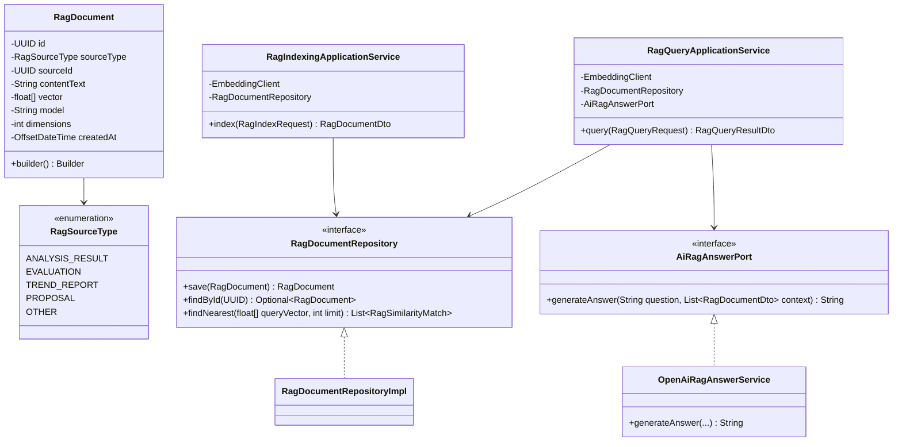
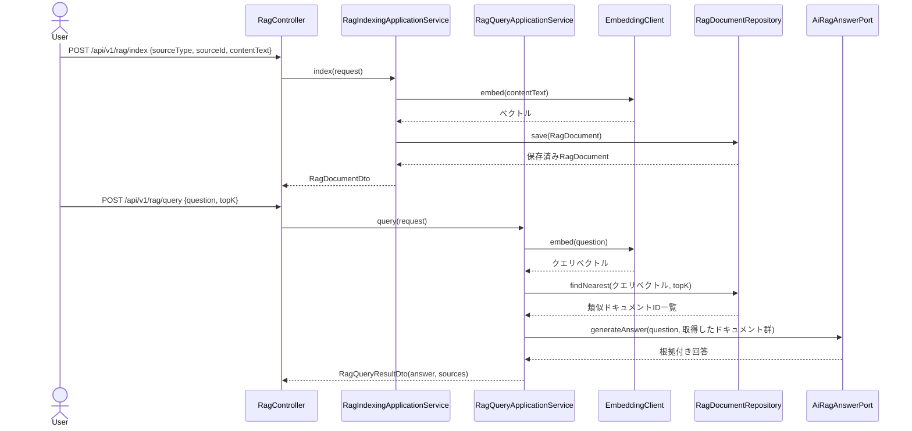

# Phase16: RAG（Retrieval-Augmented Generation）

## 1. 目的

過去の分析結果・投稿評価・トレンドレポート等の蓄積データを検索対象とし、質問に対してAIが根拠となる過去データを引用しながら回答するRAGアーキテクチャを構築する。

## 2. セルフレビュー（実現可能性・設計論点）

### 2.1 データ取得の実現可能性

新規の外部SNSデータ取得は発生しない。既に蓄積済みのデータ（分析結果・評価・トレンド等）と、OpenAI Embeddings/Chat Completions APIのみで完結する。

### 2.2 検索対象とする既存データの範囲（Phase3のEmbeddingインフラをどこまで再利用できるか）

Phase3/4の`embeddings`テーブル・`EmbeddingRepository`は**投稿（`posts`）専用**に設計されている（`post_id`が`NOT NULL`のFK、`findByPostIdAndTarget`等のAPIも投稿前提）。RAGで参照したいのは投稿そのものではなく「分析結果・投稿評価・トレンドサマリー」等の**多様なテキスト**であるため、既存の`embeddings`テーブルを流用（スキーマ変更してポリモーフィックにする等）すると、Phase3/4の既存の動作中コードに影響するリスクがある。

→ **再利用するのは「パターン」であり「テーブル」ではない**という判断をする:
- 再利用: `EmbeddingClient`インターフェース（テキスト→ベクトル生成、Phase3で実装済み。投稿に依存しない汎用的な抽象）、`VectorType`（pgvector用Hibernateカスタム型）、HNSWインデックスの採用方針。
- 新設: `rag_documents`という新規テーブル・`RagDocumentRepository`（Phase13の`image_prompt_sets`と同様、`source_type`/`source_id`のポリモーフィックな参照を持つが、FK制約は付けない）。

**索引対象の範囲**: 全既存データを自動的に索引化するのではなく、**明示的なインデックス登録API（`POST /api/v1/rag/index`）を通じて登録されたテキストのみ**を検索対象とする（オプトイン方式）。理由:
- Phase3のEmbedding生成が「差分があれば再生成」というコスト意識を持っていたのと同様、全データを無条件に索引化するとAPIコストが際限なく増える。
- どのデータを「過去の成功/失敗事例」として参照する価値があるかは利用者側の判断に委ねる方が柔軟（例: 高スコアの投稿評価だけを選んで索引化する、等）。
- 既存フェーズ（Phase10/14/15）のコードに自動索引化のフックを追加すると、既に本番相当で動いている既存ユースケースに変更を加えることになり、リグレッションリスクが生じる。本フェーズでは既存フェーズのコードは一切変更せず、独立した新機能として追加する。

### 2.3 RAGの回答生成をどのユースケースに適用するか（企画生成AI等への組み込み）

Phase10（企画生成AI）等の既存ユースケースへの直接組み込みは**本フェーズのスコープ外**とする（上記2.2の「既存フェーズを変更しない」方針と一貫）。代わりに、**独立した質問応答API（`POST /api/v1/rag/query`）**として提供する。利用イメージ: 「過去に美容ジャンルで成功したフックパターンは？」等の自然文質問に対し、索引化済みドキュメントの中から類似度上位を取得し、それらを根拠としてAIが回答を生成する。将来的にPhase10等がこのAPIを呼び出して企画生成のインプットに利用することは可能だが、その統合は別途の変更として扱う（改善案に記載）。

## 3. 設計

### 3.1 クラス図

### 3.2 シーケンス図

### 3.3 データ設計

`rag_documents`テーブル新設（V14マイグレーション）: `id, source_type, source_id(NULL許容), content_text, vector(pgvector 1536次元), model, dimensions, created_at`。Phase3と同じくpgvector拡張・HNSWインデックスを使用する。`source_id`はポリモーフィックな参照のためDB外部キー制約は付けない（Phase13と同方針）。

## 4. 実装結果

- `domain/rag/RagSourceType.java`（enum）, `RagDocument.java`（Builder）, `RagDocumentRepository.java`, `RagSimilarityMatch.java`
- `application/rag/AiRagAnswerPort.java`
- `application/rag/RagIndexingApplicationService.java`: 既存`EmbeddingClient`（Phase3）を再利用してテキストを索引化
- `application/rag/RagQueryApplicationService.java`: クエリのEmbedding化→類似ドキュメント取得→AI回答生成
- `application/rag/dto/RagIndexRequest.java`, `RagDocumentDto.java`, `RagQueryRequest.java`, `RagQueryResultDto.java`
- `infrastructure/external/openai/OpenAiRagAnswerService.java`: 取得済みドキュメントを根拠として提示するプロンプト。フォールバックは類似度上位ドキュメントの抜粋を機械的に連結
- `infrastructure/persistence/entity/RagDocumentEntity.java`（`VectorType`再利用）/ `mapper` / `adapter` / `repository`（pgvectorコサイン距離のネイティブクエリ、`EmbeddingJpaRepository`と同パターン）
- `db/migration/V14__rag_documents.sql`
- `presentation/controller/RagController.java`: `POST /api/v1/rag/index`, `POST /api/v1/rag/query`
- テスト: `RagIndexingApplicationServiceTest`, `RagQueryApplicationServiceTest`, `OpenAiRagAnswerServiceTest`

## 5. レビュー

### 5.1 懸念点

- オプトイン方式の索引化は柔軟だが、利用者が索引登録を忘れると回答の根拠データが不足する。将来的にダッシュボード（Phase17）から「この分析結果をRAGに登録」ボタン等のUXで補うことが考えられる。
- 索引化されたテキストが古くなった場合の更新・削除の仕組みは本フェーズでは未実装（`RagDocument`は追記のみ）。

### 5.2 改善案

- Phase10（企画生成AI）が`RagQueryApplicationService`を呼び出し、過去の高評価企画を参考情報としてAIプロンプトに含める統合は、既存フェーズへの変更となるため別タスクとして扱う。

## 6. 次フェーズプレビュー

Phase17（ダッシュボード）では、ホーム/ランキング/AI分析/トレンド/競合分析/投稿評価/AI企画/レポート/設定の各画面をNext.jsフロントエンドに実装する。セルフレビューでは「Phase1-16で実装した多数のAPIをどの画面にどうマッピングするか」「既存のNext.jsダッシュボード基盤（Stage Aで実装済み）とどう統合するか」を中心に整理する。
