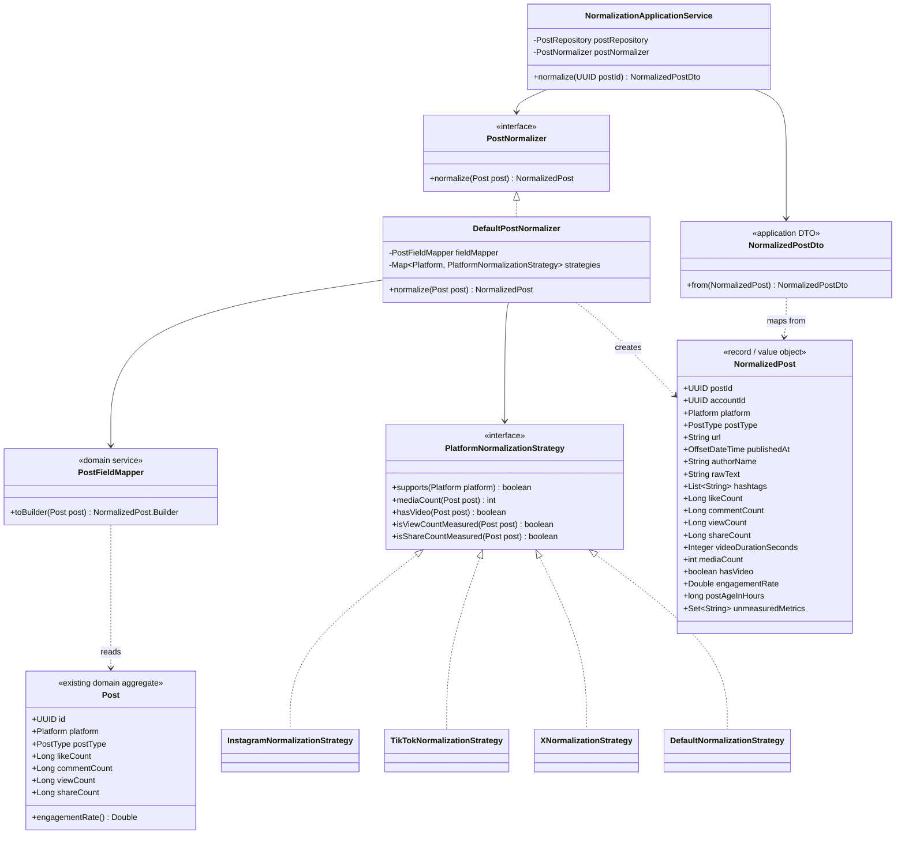
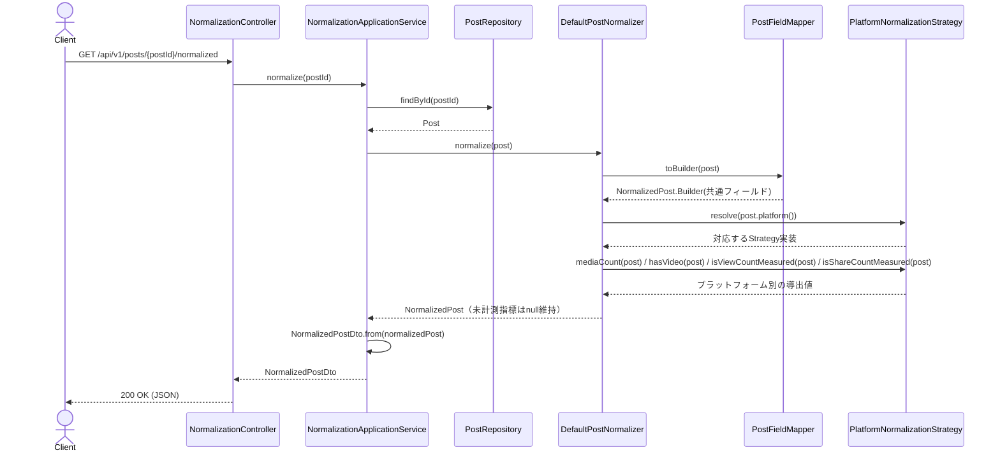

# Phase1: SNS投稿データの正規化レイヤー（NormalizedPost / DTO / Mapper / Normalizer）

## 1. 目的

Instagram / TikTok / X（将来 YouTube / Threads）から収集済みの `Post`（`backend/src/main/java/com/buzzanalysis/domain/post/Post.java`）は、プラットフォームごとにデータの粒度・欠損パターン・単位が微妙に異なる。Phase2以降（前処理・Embedding生成・AI分析・ランキング等）が安心して利用できる**単一の正規化済みデータ構造**を用意する。

## 2. フィージビリティ・セルフレビュー（実装開始前）

- **新規の外部API呼び出しは発生しない。** 既存の `PostRepository` に保存済みのデータ（＝収集済みの公開データのみ）を変換するだけであり、「取得できない情報を取得しようとしない」というルールに抵触しない。
- `docs/phases/00_sns_data_constraints.md` の方針どおり、`viewCount` / `shareCount` が未計測（プラットフォーム上取得不可、またはこの投稿種別では非公開）の場合は **`null`のまま保持し、0や推定値で埋めない**。
- YouTube / Threadsは収集アダプタ未実装だが、正規化レイヤー自体はプラットフォーム非依存に設計するため、今回のフェーズで対応しても実害・矛盾は生じない（Strategyパターンで拡張済み）。
- 結論: **Phase1はそのまま実装可能**。代替案の検討は不要。

## 3. 設計判断

| 要求された成果物 | 実装クラス | 役割 |
|---|---|---|
| NormalizedPost | `domain/normalization/NormalizedPost.java` | プラットフォーム非依存の正規化済み投稿データ（Phase2以降が参照する唯一の入力契約） |
| Mapper | `domain/normalization/PostFieldMapper.java` | `Post`（既存集約）から共通フィールドをそのまま写し取る、純粋な構造マッピング |
| Normalizer | `domain/normalization/PostNormalizer.java`（IF）/ `DefaultPostNormalizer.java`（実装） | Mapperの結果に対し、プラットフォーム別Strategyを適用して`NormalizedPost`を完成させるオーケストレーター |
| （Strategy拡張） | `domain/normalization/strategy/PlatformNormalizationStrategy.java` ほか | プラットフォームごとに異なる「メディア件数の数え方」「再生数/シェア数が公開情報として信頼できるか」等の差異を吸収する（Strategyパターン） |
| DTO | `application/normalization/dto/NormalizedPostDto.java` | API/アプリケーション層向けの転送用オブジェクト |

`NormalizedPost` は独立テーブルに永続化しない（既存の `posts` テーブルと二重管理にしない）。`Post` から都度導出するビューであり、Phase3のEmbedding保存時には `post_id` をそのまま外部キーとして使う設計とする（詳細はPhase3で決定）。

`unmeasuredMetrics`（未計測フィールド名の集合）を`NormalizedPost`に持たせることで、「AIによる推定値と実測値を混同しない」という最重要ルールを後続フェーズが機械的に守れるようにした。

## 4. クラス図

## 5. シーケンス図

## 6. 実装結果

- `domain/normalization/` : `NormalizedPost`（Builder付き）, `PostFieldMapper`, `PostNormalizer`, `DefaultPostNormalizer`
- `domain/normalization/strategy/` : `PlatformNormalizationStrategy`, `InstagramNormalizationStrategy`, `TikTokNormalizationStrategy`, `XNormalizationStrategy`, `DefaultNormalizationStrategy`（YouTube/Threads/Pinterest等、専用Strategy未実装のプラットフォーム向けフォールバック）
- `infrastructure/config/NormalizationConfig.java` : `BuzzScoreConfig`と同じ方式で、フレームワーク非依存のドメインStrategy群をSpring Beanとして配線
- `application/normalization/` : `NormalizationApplicationService`, `dto/NormalizedPostDto`
- `presentation/controller/NormalizationController.java` : `GET /api/v1/posts/{postId}/normalized`
- テスト: `DefaultPostNormalizerTest`（Mockitoなしのプレーンな単体テスト。Instagram/TikTok/Xそれぞれの未計測指標の扱いを検証）、`NormalizationApplicationServiceTest`（Mockito）

## 7. レビュー

**良かった点**
- 既存の `BuzzScoreCalculator`/`PlatformFactoryImpl` と同じ「ドメイン層は純粋なPOJO、Spring配線はinfrastructure層のConfigurationクラスに閉じ込める」パターンを踏襲できたため、コードベース全体の一貫性が保たれた。
- `unmeasuredMetrics` を明示フィールド化したことで、「実測値と推定値を混同しない」というプロジェクト最重要ルールを、後続フェーズが型で強制される形にできた（コメントだけに頼らない設計）。

**懸念点・改善案**
1. 現状 `NormalizedPost` は永続化しない設計にしたが、Phase3（Embedding生成）・Phase5（AI分析）が同じ投稿を何度も正規化・分析することになると、DB読み出しコストが積み重なる可能性がある。→ **改善案**: Phase2で導入する前処理結果（クリーンテキスト等）と合わせて、必要になった時点で `normalized_post_cache`（Redis）または専用カラムでのキャッシュを検討する（今は時期尚早なため見送り）。
2. `DefaultNormalizationStrategy`（YouTube/Threads用フォールバック）は保守的に「再生数・シェア数はすべて未計測扱い」としている。実際にYouTube収集アダプタを実装する際は専用Strategyに差し替える必要がある（TODOコメントを残した）。
3. `mediaCount` の定義（カルーセル=画像枚数、動画/テキスト=1）は主観的な設計判断。Phase8（共通点分析）で「投稿構成の共通点」を見る際にこの値を使う予定なので、その時点で妥当性を再検証したい。

## 8. Phase2 プレビュー

Phase2（AI分析用前処理）では、`NormalizedPost.rawText` を入力として、絵文字除去・URL除去・HTML除去・改行整理・日本語/英語判定・ハッシュタグ抽出（`NormalizedPost.hashtags`は収集時点のものをそのまま使うか、本文からの再抽出と突き合わせるかを設計時に検討）・メンション抽出・投稿時間解析・動画時間解析・投稿タイプ判定を行う `PostPreprocessor`（Strategy or Pipelineパターン想定）を追加する。`NormalizedPost` を汚さず、`PreprocessedPost`（新しい値オブジェクト）として出力する設計を予定している。実装前に同様のフィージビリティ・セルフレビューを行う。
