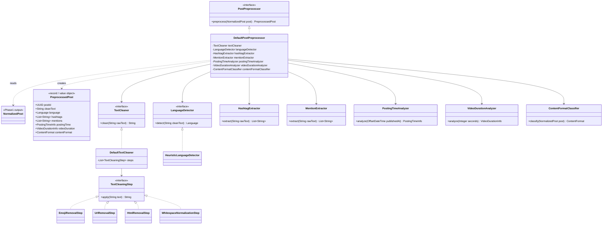
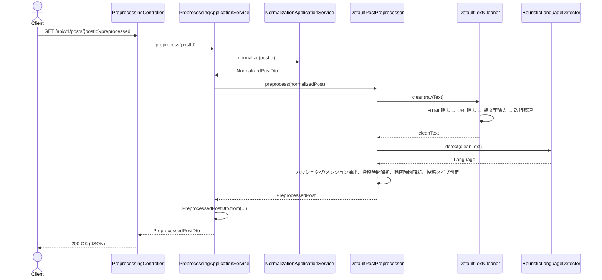

# Phase2: AI分析用前処理（PreprocessedPost）

## 1. 目的

`NormalizedPost`（Phase1）の `rawText` はプラットフォームから収集したままの未加工テキストであり、絵文字・URL・HTMLタグ・不揃いな改行を含む。Phase3（Embedding生成）・Phase5（投稿分析AI）が安定した入力を扱えるよう、テキストのクレンジングと言語判定・ハッシュタグ/メンション抽出・投稿時間解析・動画時間解析・投稿タイプ判定を行い、`PreprocessedPost` として出力する。

## 2. フィージビリティ・セルフレビュー

- すべてPhase1で既に取得済み・正規化済みのデータ（`rawText`, `publishedAt`, `videoDurationSeconds`, `hasVideo`, `mediaCount`）に対する**純粋なテキスト処理・分類ロジック**であり、新規の外部API呼び出しは発生しない。
- 言語判定・投稿タイプ判定は**ヒューリスティック（規則ベース）**であり、AIによる推定ではない。今後Phase5以降でOpenAIによる分析結果と混同しないよう、`PreprocessedPost` はAI生成物を一切含まない（すべて決定的なルールで導出される）ことを設計上の原則とする。
- 結論: **Phase2はそのまま実装可能**。代替案の検討は不要。

## 3. 設計判断

| 要求された処理 | 実装クラス | 方式 |
|---|---|---|
| 絵文字除去 | `steps/EmojiRemovalStep` | 正規表現（Unicode絵文字関連ブロックの範囲指定）。網羅的な絵文字辞書ではないため、本番では `emoji-java` 等の専用ライブラリへの置き換えを推奨（コメントに明記） |
| URL除去 | `steps/UrlRemovalStep` | 正規表現 (`https?://\S+`) |
| HTML除去 | `steps/HtmlRemovalStep` | 正規表現によるタグ除去 + 主要HTMLエンティティのデコード |
| 改行整理 | `steps/WhitespaceNormalizationStep` | 連続改行の圧縮、行頭行末トリム、連続空白の圧縮 |
| 日本語/英語判定 | `LanguageDetector`（IF）/ `HeuristicLanguageDetector` | ひらがな・カタカナ・漢字・ラテン文字の出現比率によるヒューリスティック判定。将来AIベースの判定器に差し替え可能なようインターフェース化 |
| ハッシュタグ抽出 | `HashtagExtractor` | `rawText` から正規表現で再抽出（収集時点のメタデータ由来の値とは独立に、テキストから直接導出することで一貫性を担保） |
| メンション抽出 | `MentionExtractor` | 正規表現 (`@[A-Za-z0-9_.]+`) |
| 投稿時間解析 | `PostingTimeAnalyzer` | `publishedAt` から時間帯(TimeSlot)・曜日・週末フラグを算出 |
| 動画時間解析 | `VideoDurationAnalyzer` | `videoDurationSeconds` から尺カテゴリ(DurationCategory)を算出。Phase11の30/60/90秒台本生成の目安に対応 |
| 投稿タイプ判定 | `ContentFormatClassifier` | プラットフォーム別の `PostType` を、SNS横断で比較可能な `ContentFormat`（SHORT_VIDEO/LONG_VIDEO/SINGLE_IMAGE/MULTI_IMAGE_CAROUSEL/TEXT_ONLY）に再分類 |

テキストクレンジングの4ステップ（絵文字/URL/HTML/改行）は **Strategyパターン**（`TextCleaningStep`）とし、`DefaultTextCleaner` が順序どおり適用するパイプラインとして実装する（新しいクレンジング処理を追加する際は `TextCleaningStep` 実装を1つ増やすだけでよい）。

`PreprocessedPost` はAI生成値を一切含まない（決定的ルールのみ）。Phase5でAIが生成する分析結果とは明確にレイヤーを分離する。

## 4. クラス図

## 5. シーケンス図

## 6. 実装結果

- `domain/preprocessing/`: `PreprocessedPost`（Builder付き）, `Language`, `TimeSlot`, `DurationCategory`, `ContentFormat`, `PostingTimeInfo`, `VideoDurationInfo`
- `domain/preprocessing/steps/`: `TextCleaningStep`(IF), `EmojiRemovalStep`, `UrlRemovalStep`, `HtmlRemovalStep`, `WhitespaceNormalizationStep`
- `domain/preprocessing/`: `TextCleaner`(IF)/`DefaultTextCleaner`, `LanguageDetector`(IF)/`HeuristicLanguageDetector`, `HashtagExtractor`, `MentionExtractor`, `PostingTimeAnalyzer`, `VideoDurationAnalyzer`, `ContentFormatClassifier`, `PostPreprocessor`(IF)/`DefaultPostPreprocessor`
- `infrastructure/config/PreprocessingConfig.java`: `NormalizationConfig`と同方式でBean配線
- `application/preprocessing/`: `PreprocessingApplicationService`, `dto/PreprocessedPostDto`
- `presentation/controller/PreprocessingController.java`: `GET /api/v1/posts/{postId}/preprocessed`
- テスト: 各テキストクレンジングステップ・言語判定・ハッシュタグ/メンション抽出・投稿時間/動画時間解析・コンテンツフォーマット分類・オーケストレーター(`DefaultPostPreprocessor`)の単体テスト

## 7. レビュー

**良かった点**
- テキストクレンジングをStrategyパターン（`TextCleaningStep`のリスト）にしたことで、Phase16（RAG）等で追加のクレンジング要件（例: 定型文除去）が出てきても、既存コードを変更せずStepを1つ追加するだけで対応できる。
- `PreprocessedPost` がAI生成値を含まない設計原則を明文化したことで、Phase5以降のAI分析結果とレイヤーが混ざらない。

**懸念点・改善案**
1. 絵文字除去は正規表現ベースであり、Unicode絵文字の全パターンを網羅していない（新しい絵文字が追加された場合に漏れる可能性がある）。→ **改善案**: 実運用で誤検知/漏れが問題になった場合、`emoji-java` 等の専用ライブラリへの置き換えを検討する。
2. 言語判定は「かな/カタカナの有無」中心のヒューリスティックであり、漢字のみで構成される文（日本語と中国語の判別が困難なケース）は日本語と推定している。→ **改善案**: 精度が問題になれば、Apache Tika langdetect等の統計的言語判定ライブラリに置き換える（インターフェース化済みのため差し替えは容易）。
3. ハッシュタグ抽出を「収集時点のメタデータ」ではなく「クレンジング前の`rawText`からの再抽出」にした設計判断について: プラットフォームAPIが返すハッシュタグ一覧と、本文中に実際に書かれたハッシュタグ文字列は完全一致するとは限らない（例: 位置情報タグ等はAPI側のみに存在）。今回はテキスト由来を正としたが、Phase8（共通点分析）で両者に乖離が大きい場合は再検討する。

## 8. Phase3プレビュー

Phase3（Embedding生成）では、`PreprocessedPost.cleanText` 等を入力としてOpenAI Embeddings APIを呼び出し、タイトル・本文・ハッシュタグ・コメント要約のEmbeddingベクトルを生成し、PostgreSQL + pgvectorへ保存する。ここで初めて外部AI APIへの呼び出し（コスト発生）が入るため、実装前のセルフレビューでは「呼び出し回数・レート制限・コスト」「pgvector拡張の導入方法（Flywayマイグレーション、Docker Composeのpostgresイメージをpgvector対応イメージへ変更する必要があるか）」を重点的に確認する。
