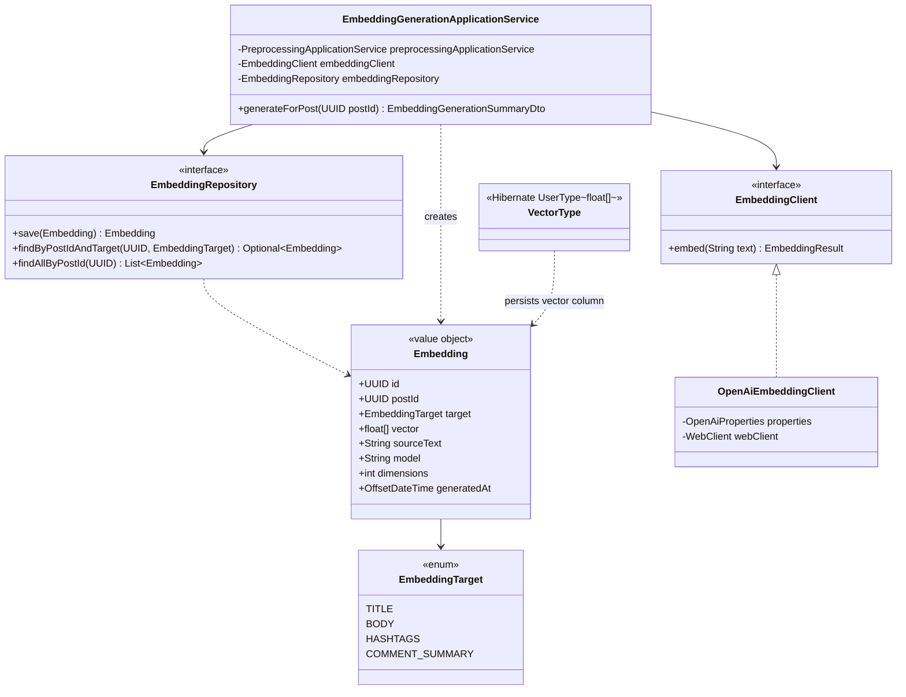
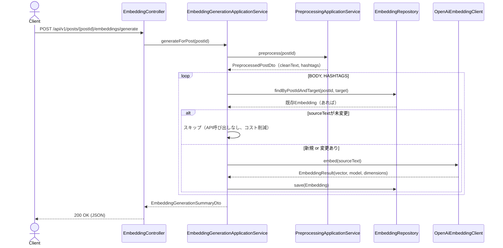

# Phase3: Embedding生成（OpenAI Embeddings API + pgvector）

## 1. 目的

Phase2で前処理済みの投稿テキストを、OpenAI Embeddings APIでベクトル化し、PostgreSQL + pgvectorへ保存する。Phase4（意味検索）・Phase6（一致率算出）はこのベクトルを利用する。

## 2. フィージビリティ・セルフレビュー（実装開始前）

Phase3で初めて「外部AI APIへの実呼び出し（コスト発生）」と「新しいインフラ要素（pgvector拡張）」が入るため、通常より踏み込んで確認する。

### 2.1 生成対象の再検討（重要・代替案あり）

要求仕様では生成対象を「タイトル・本文・ハッシュタグ・コメント要約」の4種としているが、現在収集済みのデータ（`Post`/`NormalizedPost`）を精査した結果、以下の制約が判明した。

| 生成対象 | 現状の可否 | 理由 | 代替案 |
|---|---|---|---|
| **本文** | ✅ 実装可能 | Phase2の `PreprocessedPost.cleanText` がそのまま使える | そのまま実装 |
| **ハッシュタグ** | ✅ 実装可能 | Phase2の `hashtags` 一覧をスペース区切りの文字列に結合すれば埋め込み可能 | そのまま実装 |
| **タイトル** | ⚠️ 現状データなし | Instagram/TikTok/Xの投稿には、YouTubeのような独立した「タイトル」フィールドが存在しない（公式APIも本文/キャプションのみを提供） | 本フェーズでは**タイトル埋め込みを実装しない**。将来YouTube収集アダプタを追加した際、`NormalizedPost` にタイトルフィールドを拡張し、対応する（`EmbeddingTarget.TITLE` は列挙型として予約するが、生成処理は未対応として明示的に例外を返す） |
| **コメント要約** | ❌ 実装不可（現状） | 本システムは投稿の**コメント数**のみを収集しており、**コメント本文**は収集していない。コメント本文の収集は「00_sns_data_constraints.md」で整理した取得可能データの範囲外の作業（各社コメント一覧APIの追加審査・スコープが必要）であり、最重要ルール「他人の非公開データは取得対象外」との整合性も別途精査が必要 | 本フェーズでは**コメント要約埋め込みを実装しない**。コメント本文収集自体を将来の独立したフェーズ（要件定義・規約確認から必要）として切り出す。`EmbeddingTarget.COMMENT_SUMMARY` は列挙型として予約するが、生成処理は未対応として明示的に例外を返す |

→ **結論**: Phase3で実装するのは **本文** と **ハッシュタグ** の2種のみ。`EmbeddingTarget` 列挙型は4値すべてを持たせ将来の拡張点を明示するが、実際に生成できるのはこの2種であることをコード・ドキュメント双方に明記する。

### 2.2 コスト・レート制限

- OpenAI Embeddings API（`text-embedding-3-small`、1536次元、低コスト帯のモデルを既定とする）はトークン課金のため、**同一投稿・同一対象への再生成を避ける**必要がある。→ 既存の `embeddings` レコードと `sourceText` を比較し、変更がなければAPI呼び出しをスキップする実装とする（Phase「定期データ取得バッチ」で投稿が再取得されるたびに毎回課金が発生しないようにするため）。
- 複数投稿・複数対象をまとめて処理する場合に備え、既存の `batch.sync.delay-between-accounts-ms` と同様のポリシーで、呼び出し間隔を設定可能にする（本フェーズでは1件ずつの同期APIとして実装し、バッチ化はPhase15トレンド分析等で必要になった時点で改めて設計する）。
- APIキー未設定時は、既存の `OpenAiAnalysisService` と同じ方針で、決定的な擬似ベクトル（テキストのハッシュ値からシード生成）にフォールバックする。**擬似ベクトルは実際の意味的類似度を表さない**ため、ログに警告を出し、後述のDTOにも `model` フィールドで判別可能にする（実測値と疑似値を混同しないという最重要ルールの精神を踏襲）。

### 2.3 pgvector導入

- 現在の `docker-compose.yml` の `postgres:16-alpine` イメージには pgvector拡張が含まれないため、**`pgvector/pgvector:pg16`**（pgvector公式が配布するPostgreSQL 16 + pgvector同梱イメージ）に変更する。
- FlywayマイグレーションでON `CREATE EXTENSION IF NOT EXISTS vector;` を実行し、`embeddings` テーブルに `vector(1536)` 型カラムを追加する。
- SpringのORM(Hibernate 6)は `vector` 型を標準サポートしないため、`org.hibernate.usertype.UserType<float[]>` を実装したカスタム型（`VectorType`）をJDBC `PGobject` 経由で実装する（新規の外部ライブラリ依存を追加せず、既存の `org.postgresql:postgresql` ドライバのみで完結させる）。
- **重要な制約**: 本サンドボックス環境にはDockerデーモンがなく、pgvector拡張入りPostgreSQLに対する実行時検証ができない。コンパイルレベルの検証（Hibernate 6.5.3のUserType SPIとの整合性）は行うが、実際のベクトル読み書きの動作確認は、既存の `PostRepositoryImplIT` と同様にTestcontainers統合テストとして実装し、Docker利用可能な環境（CI等）での実行を前提とする。本番投入前に必ずこの統合テストを実行することを推奨する。

### 2.4 結論

上記の代替案・制約を踏まえた上で、**Phase3は実装可能**と判断する。

## 3. 設計判断

| 要素 | 実装クラス |
|---|---|
| Embeddingドメインモデル | `domain/embedding/Embedding.java`, `EmbeddingTarget.java` |
| Embedding永続化 | `domain/embedding/EmbeddingRepository.java`（IF）/ `infrastructure/persistence/adapter/EmbeddingRepositoryImpl.java` |
| pgvectorマッピング | `infrastructure/persistence/type/VectorType.java`（Hibernate UserType） |
| OpenAI Embeddings APIクライアント | `domain/embedding/EmbeddingClient.java`（IF）/ `infrastructure/external/openai/OpenAiEmbeddingClient.java` |
| ユースケース | `application/embedding/EmbeddingGenerationApplicationService.java` |
| API | `presentation/controller/EmbeddingController.java` |

## 4. クラス図

## 5. シーケンス図

## 6. 実装結果

- `domain/embedding/`: `Embedding`, `EmbeddingTarget`, `EmbeddingRepository`(IF), `EmbeddingClient`(IF), `EmbeddingResult`
- `infrastructure/external/openai/OpenAiEmbeddingClient.java`: OpenAI `/v1/embeddings` 呼び出し。APIキー未設定時はテキストのハッシュ値をシードにした決定的な擬似ベクトルにフォールバック（ログにWARN出力）
- `infrastructure/persistence/type/VectorType.java`: `org.hibernate.usertype.UserType<float[]>` 実装。`PGobject`（type="vector"）経由でpgvectorの `vector` 型と相互変換
- `infrastructure/persistence/entity/EmbeddingEntity.java` ほかRepository/Mapper一式
- `backend/src/main/resources/db/migration/V4__pgvector_embeddings.sql`: `CREATE EXTENSION IF NOT EXISTS vector;` + `embeddings` テーブル（`post_id`+`target`一意制約）
- `docker-compose.yml`: postgresイメージを `pgvector/pgvector:pg16` に変更
- `application/embedding/EmbeddingGenerationApplicationService.java`: 本文・ハッシュタグの2対象を生成。`sourceText` 未変更時はAPI呼び出しをスキップ（コスト削減）。TITLE/COMMENT_SUMMARYは明示的に `UnsupportedOperationException` を投げ、理由をメッセージに含める
- `presentation/controller/EmbeddingController.java`: `POST /api/v1/posts/{postId}/embeddings/generate`, `GET /api/v1/posts/{postId}/embeddings`
- テスト: `EmbeddingGenerationApplicationServiceTest`（Mockito、再生成スキップ・新規生成・未対応ターゲットの例外を検証）、`OpenAiEmbeddingClientTest`（APIキー未設定時の擬似ベクトルフォールバックを検証）、`VectorTypeTest`（ResultSet/PreparedStatementをモックし、シリアライズ/デシリアライズのラウンドトリップを検証）、`EmbeddingRepositoryImplIT`（Testcontainers、`pgvector/pgvector:pg16`イメージ使用。本サンドボックスではDocker非搭載のためスキップされるが、CI等Docker利用可能な環境での実行を前提とする）

## 7. レビュー

**良かった点**
- 「タイトル」「コメント要約」を安易に埋め込み対象へ含めず、収集済みデータの実態と照らして代替案付きで明示的にスコープアウトしたことで、後続フェーズが「存在しないデータへの依存」を作り込むリスクを防げた。
- `sourceText` 比較による再生成スキップにより、Phase「定期データ取得バッチ」との組み合わせでOpenAI Embeddings APIのコストが際限なく積み上がることを防いだ。

**懸念点・改善案**
1. `VectorType` はDockerがない本環境では実行時検証ができていない。**本番投入前に必ず `EmbeddingRepositoryImplIT` をDocker環境で実行し、pgvectorとの実際の読み書きを確認すること**（未検証のまま運用に入らないよう、README/CI設定への明記を推奨）。
2. `text-embedding-3-small`（1536次元）を既定としたが、精度要件次第では `text-embedding-3-large`（3072次元）への切り替えが必要になる可能性がある。次元数はマイグレーションで固定しているため、切り替える場合は新しいマイグレーション（列の再作成 or 別カラム追加）が必要になる点に注意。
3. 類似検索用のANNインデックス（ivfflat/hnsw）は本フェーズでは作成していない（Phase4で実データが入った後に設計する）。データ量が少ない開発初期にインデックスを作ると却って非効率なための意図的な先送り。

## 8. Phase4プレビュー

Phase4（意味検索エンジン）では、本フェーズで蓄積したEmbeddingを用いて、ユーザーのキーワード（例:「楽天カード」）をEmbedding化し、pgvectorのコサイン類似度演算子（`<=>`）でベクトル検索を行う。実装前のセルフレビューでは「検索対象データ量に応じたANNインデックス（ivfflat/hnsw）の要否」「一致率（類似度スコア）の表示方法」を中心に確認する。
