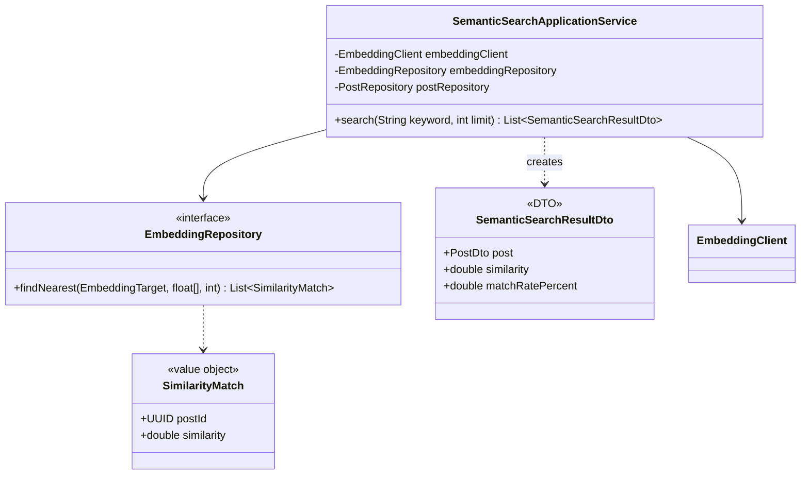
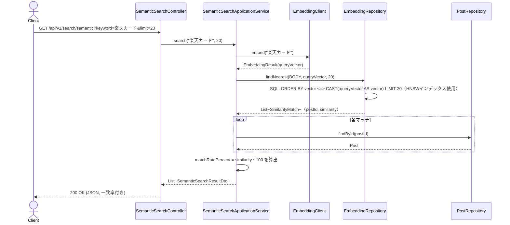

# Phase4: 意味検索エンジン（ベクトル検索 + コサイン類似度）

## 1. 目的

ユーザーが「楽天カード」のようなキーワードで検索した際、文字列としては一致しない「楽天経済圏」「楽天Pay」「ポイント還元」「SPU」「ポイ活」等の**意味的に近い投稿**も検索結果に含める。Phase3で蓄積したEmbeddingとpgvectorのコサイン距離演算子（`<=>`）を用いる。

## 2. フィージビリティ・セルフレビュー

- Phase3で構築済みの `EmbeddingClient`（検索キーワードのベクトル化）と `embeddings` テーブル（pgvector）をそのまま利用できる。新規の外部データ取得は発生しない。
- **既知の制約（重要）**: 意味検索の対象は、Phase3で **BODY のEmbeddingが既に生成済みの投稿のみ**である。投稿を収集しただけではEmbeddingは自動生成されない（Phase3は明示的なAPI呼び出し、または将来的に「定期データ取得バッチ」等と連携してEmbeddingを生成する運用が前提）。この制約はAPI応答にドキュメントとして明記し、フロントエンド側でも「Embedding未生成の投稿は検索対象外」であることを利用者に伝えられるようにする（本フェーズではバックエンドAPIとドキュメントの整備までとし、運用上のEmbedding生成バッチ化はスコープ外とする）。
- **ANNインデックスの導入**: Phase3レビューで先送りしていた類似検索用インデックスを本フェーズで追加する。データ量が少なくても劣化しにくい **HNSWインデックス**（pgvector 0.5.0以降で利用可能。`pgvector/pgvector:pg16` は対応バージョンを同梱）を採用し、IVFFlat（事前学習が必要でデータ量に敏感）は避ける。
- コサイン類似度の算出はpgvectorのネイティブSQL（`<=>` 演算子）に委譲し、JPQLでは表現できないためSpring Data JPAのネイティブクエリを使用する。
- 結論: **Phase4は実装可能**。上記の制約（Embedding未生成投稿は検索対象外）を仕様として明記した上で進める。

## 3. 設計判断

| 要素 | 実装 |
|---|---|
| 類似度計算 | pgvectorの `<=>`（コサイン距離）演算子。`類似度 = 1 - 距離` として算出 |
| 一致率表示 | `matchRatePercent = round(類似度 * 100, 0〜100にクランプ)` |
| 検索対象 | `EmbeddingTarget.BODY` のみ（本文Embedding。ハッシュタグ等の複合スコアリングはPhase6で扱う） |
| ANNインデックス | HNSW（`vector_cosine_ops`）、`target='BODY'` の部分インデックス |
| クエリベクトル生成 | Phase3の `EmbeddingClient` をそのまま再利用 |
| 結果キャッシュ | 同一キーワード・limitの組み合わせをRedisで10分キャッシュ（OpenAI呼び出し+ベクトル検索の双方を削減） |

## 4. クラス図

## 5. シーケンス図

## 6. 実装結果

- `domain/embedding/SimilarityMatch.java`: 類似検索結果の値オブジェクト
- `EmbeddingRepository.findNearest(...)` を追加。実装（`EmbeddingRepositoryImpl`）はSpring Data JPAのネイティブクエリ（`EmbeddingJpaRepository`）でpgvectorの `<=>` 演算子を使用
- `backend/src/main/resources/db/migration/V5__embeddings_ann_index.sql`: HNSW部分インデックス作成
- `application/semanticsearch/SemanticSearchApplicationService.java`: キーワードEmbedding化 → 類似検索 → 投稿詳細付与 → 一致率算出。結果はRedisで10分キャッシュ（`semanticSearchResults`）
- `presentation/controller/SemanticSearchController.java`: `GET /api/v1/search/semantic`
- `infrastructure/persistence/type/VectorType`: `toVectorLiteral`/`parseVectorLiteral` を `public` 化（Repositoryアダプタからの再利用のため）
- テスト: `SemanticSearchApplicationServiceTest`（Mockito、一致率変換・0〜100クランプ・limit伝播を検証）、`EmbeddingRepositoryImplIT` に `findNearest` の統合テストを追加（Docker利用可能環境での実行が前提）

## 7. レビュー

**良かった点**
- 「Embedding未生成の投稿は検索対象外」という制約を隠さず仕様として明記したことで、将来「検索結果が少ない/期待した投稿が出てこない」という問い合わせが来た際に原因を即座に説明できる。
- HNSWインデックスの採用により、IVFFlatで起こりがちな「データ量が少ない開発初期にインデックスが逆に検索精度を落とす」問題を回避した。

**懸念点・改善案**
1. 検索結果のRedisキャッシュ(10分)は、キャッシュ期間中に新しくEmbeddingが生成された投稿が検索結果に反映されないというトレードオフがある。競合分析/ランキングキャッシュのような明示的な無効化（Observerパターンでの eviction）は本フェーズでは実装していない。将来的に `EmbeddingGenerationApplicationService` が新規Embeddingを保存した際に `semanticSearchResults` キャッシュを無効化するイベント連携を追加することを推奨する。
2. 現状は `BODY` のEmbeddingのみで検索している。ハッシュタグ的な意味（例:「ポイ活」というハッシュタグ自体の意味的近さ）を検索スコアに反映したい場合は、Phase6（一致率算出）でBODY/HASHTAGS双方の類似度を重み付き統合する設計が必要になる。
3. HNSWインデックスの `m`/`ef_construction` パラメータはpgvectorの既定値のまま。実データでの検索精度・速度のチューニングは、実運用データが蓄積された後に改めて行う必要がある。

## 8. Phase5プレビュー

Phase5（投稿分析AI）では、OpenAI Chat Completions API（Phase「投稿URL分析」で既に導入済みの `OpenAiClient`/`OpenAiAnalysisService` と同様の仕組み）を用いて、投稿ごとにジャンル・サブジャンル・ターゲット・投稿目的・フック・CTA・投稿構成・動画構成・カルーセル構成・感情分析・文章構造・タイトル分析・ハッシュタグ分析・強み・弱み・改善案を生成し、`AnalysisResult` に類する新テーブルへ保存する。既存の `AnalysisResult`（投稿URL分析フローで既に実装済み）との重複・統合方針を実装前のセルフレビューで整理する。
