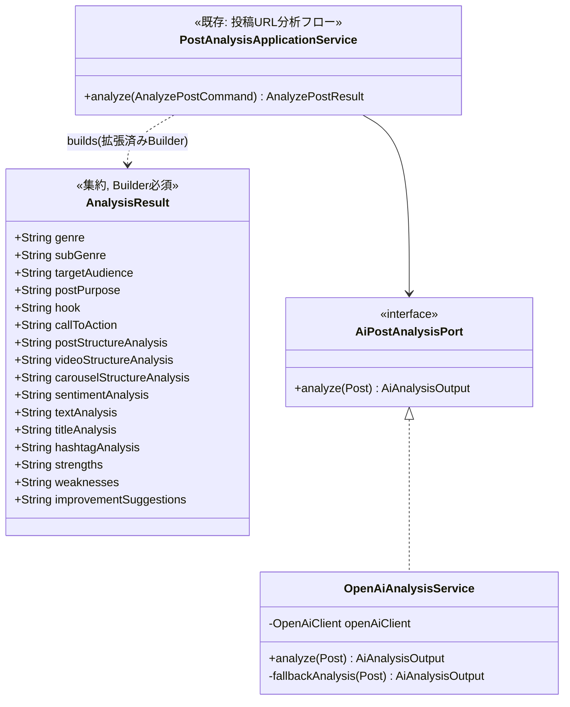

# Phase5: 投稿分析AI（ジャンル・強み弱み等の拡張分析）

## 1. 目的

各投稿についてジャンル・サブジャンル・ターゲット・投稿目的・フック・CTA・投稿構成・動画構成・カルーセル構成・感情分析・文章構造・タイトル分析・ハッシュタグ分析・強み・弱み・改善案をOpenAI APIで生成し、DBへ保存する。

## 2. フィージビリティ・セルフレビュー（重要: 既存機能との統合方針）

Phase5の着手前に、既存実装との重複を確認した。本プラットフォームには元々「投稿URL分析」フロー（`PostAnalysisApplicationService` → `OpenAiAnalysisService` → `AnalysisResult`集約 → `analysis_results`テーブル）が存在し、**要求仕様の18項目中12項目は既に実装済み**であることが判明した。

| Phase5要求項目 | 既存実装 | 判定 |
|---|---|---|
| ターゲット | `targetAudience` | 既存を流用 |
| フック | `hook` | 既存を流用 |
| CTA | `callToAction` | 既存を流用 |
| 動画構成 | `videoStructureAnalysis` | 既存を流用 |
| カルーセル構成 | `carouselStructureAnalysis` | 既存を流用 |
| 感情分析 | `sentimentAnalysis` | 既存を流用 |
| タイトル分析 | `titleAnalysis`（Phase3の制約どおり、独立タイトルが無いためキャプション冒頭を代理分析） | 既存を流用 |
| ハッシュタグ分析 | `hashtagAnalysis` | 既存を流用 |
| 改善案 | `improvementSuggestions` | 既存を流用 |
| 文章構造 | `textAnalysis`（既存は「文章分析」） | **統合**: 別カラムを新設せず、既存`textAnalysis`のプロンプト範囲を「文章分析+構造分析」に拡張する（詳細は下記） |
| ジャンル | なし | **新規追加** |
| サブジャンル | なし | **新規追加** |
| 投稿目的 | なし | **新規追加** |
| 投稿構成 | なし（動画/カルーセル固有の構成分析はあるが、投稿種別によらない全体構成分析が無い） | **新規追加** |
| 強み | なし | **新規追加** |
| 弱み | なし | **新規追加** |

### 2.1 結論・設計方針

要求どおり「AnalysisResultテーブルを作成する」ことを字義通りに解釈し**別テーブルを新設すると、1投稿に対して2つの分析結果テーブルが並存**し、「投稿URL分析」フローとPhase5フローのどちらが正なのか利用者・実装者双方が混乱する（DDDにおける「1つの集約が1つの一貫した状態を持つ」原則にも反する）。

→ **既存の `AnalysisResult` 集約・`analysis_results` テーブルを拡張**し、新規6項目（ジャンル/サブジャンル/投稿目的/投稿構成/強み/弱み）をカラム追加する方針とする。「投稿URL分析」フロー（`POST /api/v1/posts/analyze`）を実行すると、Phase5の全項目を含む分析結果が一度に得られるようになる（利用者から見て分析の入口が1つに保たれる）。

この統合により新規の外部API呼び出し方式や認証は不要（既存の`OpenAiClient.chatComplete`をそのまま利用）であり、**実現可能**と判断する。

## 3. 設計判断

- `AnalysisResult`（ドメイン）・`AnalysisResultEntity`（JPA）・`AnalysisResultDto`・`AiPostAnalysisPort.AiAnalysisOutput` に6フィールドを追加する。
- `genre` / `subGenre` / `postPurpose` は短い分類ラベルのため `VARCHAR(100)`、`postStructureAnalysis` / `strengths` / `weaknesses` は自由記述のAI生成文のため既存項目と同じ `TEXT` とする。
- `OpenAiAnalysisService` のSYSTEM_PROMPTに新規JSONキーを追加し、フォールバック（ルールベース簡易分析）にも対応するロジックを追加する（OpenAI未接続でも構造が崩れないようにする、既存方針の踏襲）。
- `docs/openapi.yaml` の `AnalysisResult` スキーマは、実装当初から理想化されたスキーマ（`aiModel`/`status`/`SentimentAnalysis`オブジェクト等）で実装とは既に乖離していた（Phase5着手前からの既存差分であり、本フェーズで新規に生じたものではない）。本フェーズではこの乖離の全面的な解消は対象外とし、`docs/phases/phase5_post_analysis.md`（本書）と`docs/09_db_design.md`を実装の正としてドキュメント化する。

## 4. クラス図

## 5. シーケンス図

既存の「投稿URL分析」シーケンス（`docs/08_sequence_diagram.md`）に変更はない。分析結果に含まれる項目が拡張されるのみ（`AiPostAnalysisPort.analyze()` が返す `AiAnalysisOutput` のフィールド数が増える）。

## 6. 実装結果

- `domain/analysis/AnalysisResult.java`: genre, subGenre, postPurpose, postStructureAnalysis, strengths, weaknesses を追加（Builder/getter含む）
- `application/post/AiPostAnalysisPort.java`: `AiAnalysisOutput` に同6フィールドを追加
- `infrastructure/external/openai/OpenAiAnalysisService.java`: SYSTEM_PROMPTに新規キーを追加、`parseResponse`/`fallbackAnalysis`を拡張
- `application/post/PostAnalysisApplicationService.java`: `buildAnalysisResult` で新規フィールドをマッピング
- `application/post/dto/AnalysisResultDto.java`: 新規フィールド追加
- `infrastructure/persistence/entity/AnalysisResultEntity.java` / `AnalysisResultMapper.java`: 新規カラム対応
- `backend/src/main/resources/db/migration/V6__analysis_result_phase5_fields.sql`: `ALTER TABLE analysis_results ADD COLUMN ...`
- テスト: 既存の `OpenAiAnalysisService` 関連テストは無かったため、新規に `OpenAiAnalysisServiceTest`（フォールバック分析が新規フィールドを含めて構造化された値を返すことを検証）を追加。`AnalysisResult`のBuilderに関するテストも追加

## 7. レビュー

**良かった点**
- 既存の「投稿URL分析」フローとの重複を実装前に発見し、テーブル・集約を分裂させずに統合できた。利用者からは分析の入口が1つのまま、取得できる情報量だけが増える。

**懸念点・改善案**
1. `docs/openapi.yaml` の `AnalysisResult` スキーマは実装開始時点から理想化されたものであり、本フェーズの新規フィールドも追加していない（既存の乖離を追認する形になった）。将来的にOpenAPIドキュメント全体を実装と同期させる棚卸しフェーズを設けることを推奨する。
2. `genre`/`subGenre`はAIの自由記述に依存しており、投稿間で表記揺れ（例:「美容」と「コスメ」）が起きうる。Phase8（共通点分析）・Phase9（競合分析）でジャンル別集計を行う際は、正規化（シノニム辞書等）が必要になる可能性がある。

## 8. Phase6プレビュー

Phase6（ユーザー条件分析・一致率算出）では、ユーザーが指定するキーワード・商品名・ジャンル・ターゲット・投稿形式等の条件と、投稿のEmbedding類似度（Phase4）・AI分析結果（Phase5、特にgenre/subGenre/targetAudience）・投稿構成/CTA/フックを総合し、0〜100点の一致率を算出する。実装前のセルフレビューでは、複数シグナル（ベクトル類似度・カテゴリ一致・構成一致）をどう重み付けするか（Strategyパターンでの実装方針）を中心に整理する。
