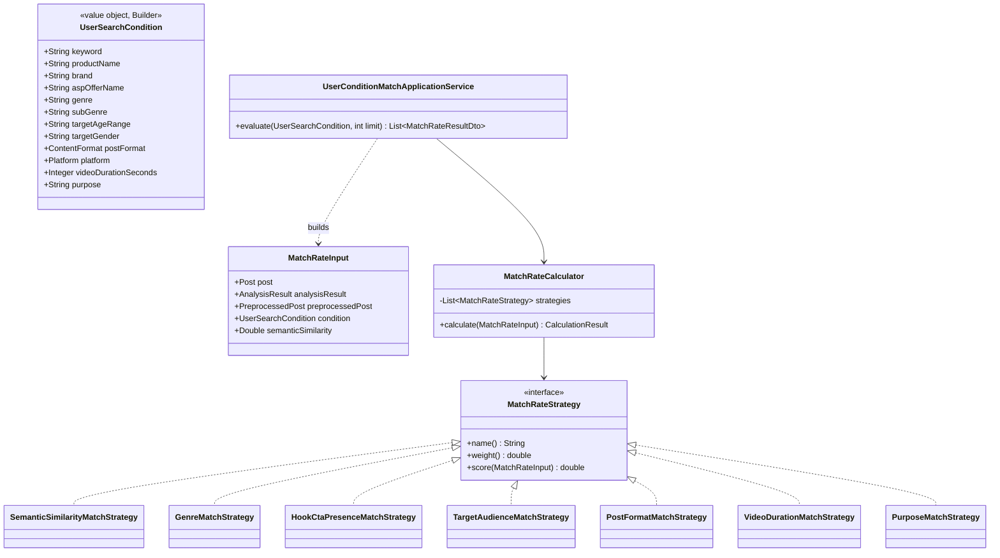

# Phase6: ユーザー条件分析（一致率算出）

## 1. 目的

ユーザーが自由入力する条件（キーワード・商品名・ブランド・ASP案件名・ジャンル・サブジャンル・ターゲット年齢/性別・投稿形式・SNS・動画時間・投稿目的等）に対し、各投稿の一致率(0〜100点)を算出する。

## 2. セルフレビュー

- キーワード/商品名/ブランド/ASP案件名は自由文のため、Phase4の意味検索（Embedding類似度）をそのまま再利用できる。
- ジャンル/サブジャンル/投稿目的はPhase5で追加済みの`AnalysisResult`フィールドと直接比較できる。
- 投稿形式(post format)・動画時間はPhase2の`PreprocessedPost`（`contentFormat`/`videoDuration`）を再利用できる。
- **既知の制約**: `targetAudience`（ターゲット層）はAIが生成する自由文（例:「20代女性、スイーツ好き」）であり、年齢・性別が構造化フィールドとして分離されていない。本フェーズでは**キーワード包含によるヒューリスティック判定**とし、AIによる構造化抽出（新たなプロンプト項目追加）は行わない（既存分析結果に手を入れず、Phase5の成果をそのまま使う）。将来的に精度が問題になれば、`AnalysisResult`に`targetAgeRange`/`targetGender`の構造化カラムを追加するフェーズを別途設ける。
- SNS(プラットフォーム)は他の条件と異なり「一致率を下げる」のではなく「対象外にする」方が自然なため、**候補取得時のハード条件（フィルタ）として扱い**、Strategyによるソフトスコアリングの対象にはしない。
- 結論: **実装可能**。上記の制約・設計判断を明記した上で進める。

## 3. 設計

`MatchRateStrategy`（Strategyパターン、`BuzzScoreStrategy`と同型）を7種実装し、`MatchRateCalculator`（Context）が重み付き平均で0〜100点を算出する。

| Strategy | 重み | 内容 |
|---|---|---|
| SemanticSimilarityMatchStrategy | 0.30 | キーワード/商品名/ブランド/ASP案件名の合成テキストとEmbeddingコサイン類似度(Phase4) |
| GenreMatchStrategy | 0.15 | ジャンル/サブジャンル一致(Phase5 AnalysisResult) |
| HookCtaPresenceMatchStrategy | 0.15 | フック/CTAが明確に分析されているか(Phase5) |
| TargetAudienceMatchStrategy | 0.10 | ターゲット年齢/性別のキーワード包含判定（ヒューリスティック） |
| PostFormatMatchStrategy | 0.10 | 投稿形式一致(Phase2 ContentFormat) |
| VideoDurationMatchStrategy | 0.10 | 希望動画時間との近さ(Phase2 VideoDurationInfo) |
| PurposeMatchStrategy | 0.10 | 投稿目的のキーワード包含判定(Phase5 postPurpose) |

候補取得は、条件に自由文（キーワード等）が含まれる場合はPhase4の`EmbeddingRepository.findNearest`で広めに候補を取得し、プラットフォーム指定があればアプリケーション層でハードフィルタする。自由文条件が無い場合は`PostRepository.search`でプラットフォームのみを条件に候補を取得する。

## 4. クラス図

## 5. 実装結果

- `domain/matching/`: `UserSearchCondition`(Builder), `MatchRateInput`, `MatchRateStrategy`(IF), `MatchRateCalculator`, `strategy/`配下7実装
- `infrastructure/config/MatchRateConfig.java`: Strategy群のBean配線(BuzzScoreConfigと同方式)
- `application/matching/UserConditionMatchApplicationService.java`: 候補取得(意味検索 or 通常検索)→プラットフォームのハードフィルタ→各Strategyでスコアリング→上位limit件を返す
- `presentation/controller/MatchingController.java`: `POST /api/v1/matching/evaluate`
- テスト: 各Strategyの単体テスト、`MatchRateCalculator`の重み付き平均検証、`UserConditionMatchApplicationService`のMockitoテスト

## 6. レビュー

**懸念点・改善案**
1. ターゲット層・投稿目的の一致判定はキーワード包含のヒューリスティックであり、表記揺れ（「20代」と「20〜25歳」等）に弱い。将来的にはPhase5のAI分析結果に構造化フィールドを追加するか、この判定自体をEmbedding類似度ベースに切り替えることを検討する。
2. プラットフォームをハードフィルタにした設計判断により、「Instagramに寄せつつ他SNSも参考程度に見たい」というニーズには対応できない。要望があればソフトスコアリングへの変更を検討する。

## 7. Phase7プレビュー

Phase7（ランキングAI）では、一致率(Phase6)・エンゲージメント率・コメント率・いいね率・投稿鮮度・AI分析・投稿構成・ハッシュタグ・動画時間を総合したランキングをStrategyパターンで実装する。既存の`BuzzScoreCalculator`/`BuzzScoreStrategy`と設計思想が同一であるため、統合方針（BuzzScoreをそのまま一因子として使うか、独立した新しいランキングスコアを設計するか）をセルフレビューで整理する。
